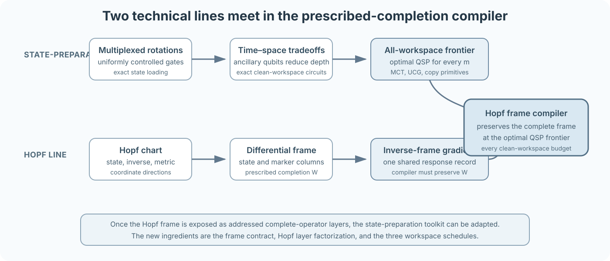
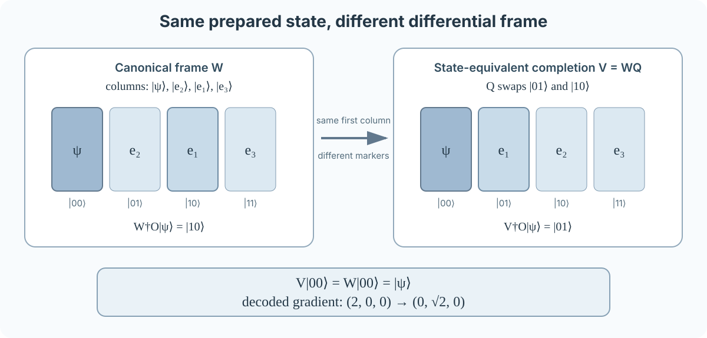
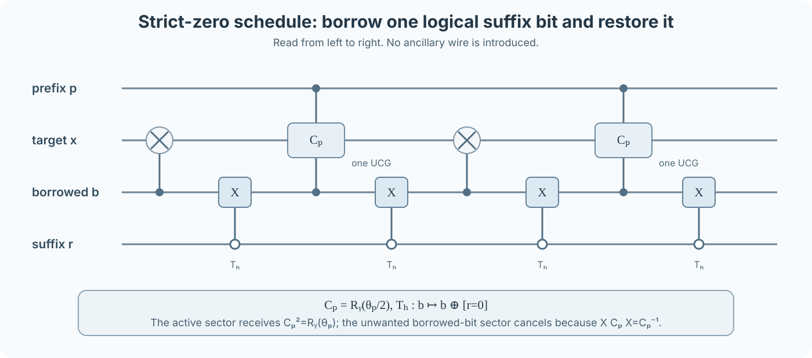
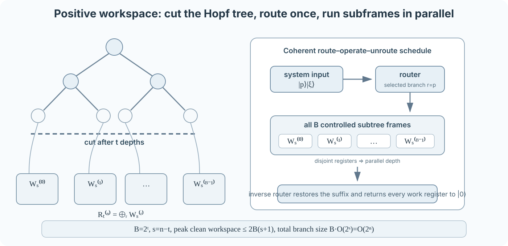

# Exact and Fault-Tolerant Compilation of Hopf Differential Frames

### A technical narrative through exact and fault-tolerant compilation

[Landing page](README.md) · [Minimal Hopf interface](docs/HOPF_INTERFACE.md) · [Formal compiler theorem](docs/COMPILER_THEOREM.md) · [Verification map](docs/VERIFICATION.md)

This is the continuous reading route for a quantum-computing reader meeting the
project for the first time. Sections 1–2 define the object. Sections 3–8 give
the exact logical compiler. Section 9 explains the finite-precision compiler,
and Section 10 connects both to gradient readout. Detailed T-count proofs are
in the [fault-tolerant chapter](docs/FAULT_TOLERANT_COMPILER.md).

## 0. Problem and results

Exact quantum state preparation with $m$ clean ancillary qubits asks for

```math
|0^n\rangle|0^m\rangle
\longmapsto
|\psi\rangle|0^m\rangle.
```

Only one initialized input is prescribed.  The compiler may choose the action on
the orthogonal complement.

The Hopf global-gradient circuit uses a prescribed unitary completion.  The
real Hopf differential frame satisfies

```math
W_{\mathbb R}|0^n\rangle=|\psi\rangle,
\qquad
W_{\mathbb R}|\lambda(j)\rangle=|e_j\rangle,
```

where the nonzero computational markers $\lambda(j)$ label the coordinate-frame
directions.  Its compiled realization must therefore satisfy

```math
\widetilde W
\bigl(|\varphi\rangle|0^m\rangle\bigr)
=(W|\varphi\rangle)|0^m\rangle
```

for every system input $\lvert\varphi\rangle$.

The question is whether this stronger map can retain the optimal all-workspace
state-preparation frontier.

### Exact logical theorem

Let

```math
N=2^n.
```

In the exact all-to-all logical model with arbitrary one-qubit gates and CNOTs,
for every integer $m\geq0$,

```math
\boxed{
S_{\mathbb R}(n,m)
=S_{\mathbb C,\mathrm{mag}}(n,m)
=\Theta(N)
}
```

and

```math
\boxed{
D_{\mathbb R}(n,m)
=D_{\mathbb C,\mathrm{mag}}(n,m)
=\Theta\left(n+\frac{N}{n+m}\right).
}
```

The upper bounds hold for every parameter tuple. The matching lower bounds
hold in the worst case over the Hopf-frame family, uniformly in the
clean-workspace budget. They do not impose the same cost on every individual
frame.

The separate CNOT count is $\Theta(N)$ for $n\ge2$, uniformly over clean
workspace, even when one-qubit gates are free. The $n=1$ count is zero.
The [formal lower-bound argument](docs/COMPILER_THEOREM.md#cnot-count-with-unrestricted-clean-workspace)
removes inactive ancillas and fuses one-qubit slots between CNOTs.

The complex unitary is the phase-dressed magnitude frame

```math
W_{\mathbb C,\mathrm{mag}}
=D_{\mathrm{ph}}W_{\mathbb R}.
```

The leaf-phase derivatives use a separate direct measurement stream.

Three schedules cover the complete workspace range.

| Workspace | Schedule | Core idea |
|---:|---|---|
| $m=0$ | borrowed-suffix echo | use one original suffix data qubit as a temporary predicate carrier and restore it exactly |
| $1\leq m<4n$ | direct flagged UCG | store the lower-suffix-zero predicate in one reusable clean flag |
| larger $m$ | routed parallel subframes | cut the tree, route the suffix coherently, and apply disjoint subtree frames in parallel |

The proof uses the all-workspace state-preparation toolkit as an exact compiler
framework.  The Hopf-specific work is to expose the complete-operator layer
structure and to organize the three schedules without losing the designated
columns.

<p align="center">
  
</p>

### Finite-precision theorem and the common contract

The second implementation model is coherent Clifford+T synthesis. Let $J_a$
initialize $a$ clean qubits, while $b$ borrowed qubits can contain arbitrary
unknown information and be entangled with a reference. The common contract is

```math
\left\|VJ_a-J_a(W\otimes I_b)\right\|\leq\eta.
```

This is an operator norm over every system/borrowed input, including the entire
output workspace. Exact logical synthesis uses $b=0$ and $\eta=0$; finite-gate
synthesis allows $\eta>0$. A prepared-column guarantee alone is insufficient
for this prescribed inverse-frame protocol.

Put $q=n+a+b$, $`L=\max\{6,\lceil\log_2(1/\eta)\rceil\}`$ and
$h=1+\lceil\log_2(L+n+2)\rceil$. For either the real or phase-dressed complex
magnitude frame, $0<\eta\leq1/64$, and
$a\geq C(n+h)$ with sufficiently large fixed $C$,

```math
T^\star=\Theta\left(\sqrt{NL}+L+\frac{NL}{q}\right),
\qquad G_{\mathrm{Clifford}}=O(NL).
```

The T bound is a worst-case optimum in its stated workspace regime. It is not
a T-depth result or simultaneous optimization of Clifford and T gates. The
complex extension follows from an addressed SU(2) diagonal compiler and
sequential reuse of the same clean pool. A finite-precision QBP consequence follows by controlling
bounded-score bias, not by differentiating a compiled word.

With two clean qubits, the separate
[operator-source construction](docs/OPERATOR_SOURCE_COMPILER.md)
implements every prescribed real Hopf frame with

```math
a=2,\qquad b\ge L+n+7,\qquad
T=O(N+nL),\qquad G_{\mathrm{Clifford}}=O(NL).
```

At $`L=N`$ and $`b=N+n+7`$, this gives $`O(N\log N)`$ T gates
against the unchanged $`\Omega(N)`$ lower bound. The logarithmic gap remains
open. The same construction supplies a dirty-bank tradeoff and a literal
phase-dressed complex magnitude corollary, with their separate workspace
conditions stated in Section 9.5.


---

## 1. Why the prescribed completion matters

### 1.1 Frame-safe compilation

The complete contract also has an operational converse. At a regular chart
point, suppose a compiler prepares the exact state and is used with its
actual adjoint and the fixed marker decoder. Preserving every designated
gradient mean for every Hermitian-unitary observable then forces the full
clean-input frame, up to one common phase. The
[necessity and sharp sensitivity proof](docs/FRAME_SAFE_COMPILATION.md#necessity-for-all-observable-dependent-gradient-means)
also handles workspace leakage and identifies the singular-coordinate and
fixed-observable exceptions.

Let

```math
J|\varphi\rangle
=|\varphi\rangle|0^m\rangle
```

append the clean compiler workspace.  A unitary $\widetilde W$ is **frame-safe** when

```math
\boxed{
\widetilde WJ=JW.
}
```

This is a complete clean-input operator equality.  It implies the inverse
identity

```math
\widetilde W^{\dagger}J=JW^{\dagger}.
```

Indeed, $\widetilde W$ maps the clean subspace onto itself.  That subspace is
therefore reducing, so the adjoint acts there as the adjoint of the logical
frame.

This is exactly the contract needed by the global Hopf gradient circuit: the
forward frame, the inverse frame, and the final measurement distribution are
unchanged after compilation.

> **Proof checkpoint.** A first-column equality gives no adjoint identity on
> the marker columns.  The reducing-subspace argument starts from the complete
> relation $\widetilde WJ=JW$.

### 1.2 A complete two-qubit obstruction

For two qubits, let

```math
|\psi\rangle
=
\cos\theta_1
\bigl(\cos\theta_2|00\rangle+
      \sin\theta_2|01\rangle\bigr)
+
\sin\theta_1
\bigl(\cos\theta_3|10\rangle+
      \sin\theta_3|11\rangle\bigr).
```

At

```math
\theta_1=\theta_2=\theta_3=\frac{\pi}{4},
```

```math
|\psi\rangle
=\frac{|00\rangle+|01\rangle+|10\rangle+|11\rangle}{2}.
```

The marker labels are

```math
\lambda(1)=10_2,
\qquad
\lambda(2)=01_2,
\qquad
\lambda(3)=11_2.
```

In computational column order,

```math
W_{\mathbb R}
=
\begin{pmatrix}
\frac12&-\frac1{\sqrt2}&-\frac12&0\\[3pt]
\frac12& \frac1{\sqrt2}&-\frac12&0\\[3pt]
\frac12&0&\frac12&-\frac1{\sqrt2}\\[3pt]
\frac12&0&\frac12& \frac1{\sqrt2}
\end{pmatrix}
=
\begin{pmatrix}
|&|&|&|\\
\psi&e_2&e_1&e_3\\
|&|&|&|
\end{pmatrix}.
```

Let $Q$ swap $\lvert01\rangle$ and $\lvert10\rangle$ while fixing $\lvert00\rangle$ and $\lvert11\rangle$, and define

```math
V=W_{\mathbb R}Q.
```

Then

```math
V|00\rangle=W_{\mathbb R}|00\rangle=|\psi\rangle,
```

so $V$ is an exact state-preparation completion for the same state.  It is not
the same differential frame because two marker columns are exchanged.

For

```math
O=-Z\otimes I,
```

one obtains

```math
W_{\mathbb R}^{\dagger}O|\psi\rangle=|10\rangle,
```

whereas

```math
V^{\dagger}O|\psi\rangle=|01\rangle.
```

The unchanged marker decoder therefore changes the gradient from

```math
(2,0,0)
```

to

```math
(0,\sqrt2,0).
```

<p align="center">
  
</p>

The point is not that a state-preparation compiler is unsuitable.  The point is
that its completion must be adapted to the columns resolved by the reverse
protocol.

### Executable counterpart

- [Frame-safe substitution](docs/FRAME_SAFE_COMPILATION.md)
- [Compiler-contract boundaries](docs/COMPILER_BOUNDARIES.md)
- [Two-qubit construction](compiler_robust_hopf/compiler_boundaries.py)
- [Exact boundary tests](tests/test_compiler_boundaries.py)

---

## 2. The Hopf operator seen by a compiler

Only a small part of the Hopf geometry enters the synthesis theorem.

### 2.1 Tree coordinates and marker columns

The real chart assigns one magnitude angle to every internal node of a complete
binary tree with $N=2^n$ leaves.  If node $j$ has depth $d$ and position $r$,

```math
j=2^d+r,
\qquad
0\leq r<2^d,
```

and its computational marker is

```math
\lambda(j)=(2r+1)2^{n-d-1}.
```

The marker bit string is the $d$-bit node prefix, followed by a one at the node
target, followed by zeros below it.

### 2.2 Differential weight and chart domain

Let $a_j(\boldsymbol\theta)$ be the oriented amplitude entering node $j$, namely the product
of the sine or cosine factors selected along the path from the root.  For
unrestricted real angles,

```math
\boxed{
\partial_{\theta_j}|\psi\rangle
=a_j|e_j\rangle,
\qquad
g_{j,j}=a_j^2.
}
```

The principal square root is $\sqrt{g_{j,j}}=\lvert a_j\rvert$.

The canonical domains are:

- real depths $0,\ldots,n-2$: $[0,\pi/2]$;
- final real depth: $[0,2\pi)$;
- every complex magnitude angle: $[0,\pi/2]$.

Only ancestor angles enter $a_j$, so on these domains

```math
a_j\geq0,
\qquad
a_j=\sqrt{g_{j,j}}.
```

If $g_{j,j}>0$, $\lvert e_j\rangle$ is the normalized coordinate derivative direction.  If
$g_{j,j}=0$, the raw derivative vanishes; the marker column remains the
chart-selected orthogonal continuation fixed by the complete parameter tuple.
The compiler target remains a unitary for every parameter tuple.

### 2.3 Addressed depth layers

At tree depth $d$, write a basis label as

```math
|p\rangle_P|x\rangle_T|z\rangle_Z,
```

where $p$ is the $d$-bit prefix, $x$ is the target qubit, and the lower suffix
$z$ has length

```math
s=n-d-1.
```

The complete depth operator is

```math
\boxed{
L_d^{(n)}
=I+
\sum_{p=0}^{2^d-1}
|p\rangle\!\langle p|
\otimes
\bigl(R_y(\theta_{d,p})-I\bigr)
\otimes
|0^s\rangle\!\langle0^s|.
}
```

The convention is

```math
R_y(\alpha)=e^{-i\alpha Y}
=
\begin{pmatrix}
\cos\alpha&-\sin\alpha\\
\sin\alpha&\cos\alpha
\end{pmatrix}.
```

The complete real frame is

```math
W_{\mathbb R}^{(n)}
=L_{n-1}^{(n)}\cdots L_1^{(n)}L_0^{(n)},
```

with $L_0$ acting first.

From a compiler viewpoint, each depth has exactly three ingredients:

1. a prefix-selected one-qubit rotation;
2. one target qubit;
3. one shared all-zero predicate on the complete lower suffix.

The suffix predicate is what preserves all frame columns established at earlier
depths.  It is also the only obstruction to compiling the depth as an ordinary
small multiplexor.

> **Proof checkpoint.** The formula for $L_d$ is an equality on the complete
> Hilbert space.  Replacing it by its action on $\lvert0^n\rangle$ would recover state
> preparation but lose the frame contract.

### Executable counterpart

- [Minimal Hopf interface](docs/HOPF_INTERFACE.md)
- [Marker convention](compiler_robust_hopf/conventions.py)
- [Recursive and addressed frames](compiler_robust_hopf/frames.py)
- [Frame and chart-domain tests](tests/test_frames.py)

---

## 3. Exact compiler toolkit

The declared circuit model consists of arbitrary one-qubit gates and CNOTs with
all-to-all logical connectivity.  Clean ancillary qubits start in $\lvert0\rangle$ and are
returned exactly to $\lvert0\rangle$.

The proof imports four results from the all-workspace state-preparation
framework.

| Imported result | Form used here |
|---|---|
| optimal QSP theorem | $\Theta(2^q)$ size and $`\Theta\!\left(q+\frac{2^q}{q+w}\right)`$ depth for a general $q$-qubit state with $w$ clean ancillas |
| ancilla-free MCT lemma | an $r$-controlled X has $O(r)$ size and depth with no ancillary qubit |
| all-workspace UCG lemma | a total-width-$`q`$ UCG has $O(2^q)$ size and $`O\!\left(q+\frac{2^q}{q+w}\right)`$ depth with $w$ clean ancillas |
| coherent-copy lemma | CNOT trees copy and uncopy one computational-basis control coherently in logarithmic depth |

Toffoli, Fredkin, controlled one-qubit gates, and the fixed-width controlled
Givens rotations used below have exact constant-size, constant-depth
decompositions in the same elementary model.

The published state-preparation results can be used once the Hopf frame has been
written as the addressed layers above.  The remaining proof task is to expose
schedules whose UCG widths and simultaneous work registers give the target
frontier while preserving the complete operator.

The earlier state-preparation paper is the historical predecessor to the
all-workspace result.  The Möttönen–Bergholm line supplies the multiplexor and
UCG language.  Exact theorem numbers and source versions are collected in the
[source map](docs/SOURCE_MAP.md).

---

## 4. Strict zero workspace

At $m=0$, the ordinary clean suffix flag is unavailable.  One original suffix
qubit can carry the predicate temporarily.

### 4.1 Borrowed-suffix decomposition

For a nonfinal depth $d<n-1$, split the suffix into one original system bit $b$
and the remaining string $r$:

```math
|p\rangle_P|x\rangle_T|b\rangle_B|r\rangle_R.
```

Define

```math
h(r)=[r=0],
\qquad
C_p=R_y(\theta_{d,p}/2).
```

Let $T_h$ toggle $b$ exactly when $h(r)=1$.  Apply the following gates in
chronological order:

```text
controlled_b(X)
T_h
controlled_b(C_p)
T_h
controlled_b(X)
T_h
controlled_b(C_p)
T_h.
```

<p align="center">
  
</p>

The half-angle and conjugation identities are

```math
C_p^2=R_y(\theta_{d,p}),
\qquad
XC_pX=C_p^{-1}.
```

For fixed $p$ and $r$, the four invariant sectors are:

| $h(r)$ | original $b$ | chronological target word | resulting matrix | final $b$ |
|---:|---:|---|---|---:|
| 0 | 0 | none | $I$ | 0 |
| 0 | 1 | $X,C_p,X,C_p$ | $C_pXC_pX=I$ | 1 |
| 1 | 0 | $C_p,C_p$ | $C_p^2=R_y(\theta_{d,p})$ | 0 |
| 1 | 1 | $X,X$ | $I$ | 1 |

The active sector is precisely the sector in which the **original** complete
suffix $br$ is zero.  Every other sector receives identity.  The borrowed bit
is toggled either zero or four times and returns to its original value.  No
sector-dependent phase appears.

Because the $p,r$ sectors form an orthogonal direct sum, this proves complete
operator equality on arbitrary superpositions, including states in which $b$
is entangled with the other system qubits.

### 4.2 Resource count

$T_h$ is an all-zero-controlled X on the borrowed system bit.  Negative-control
wrappers and the ancilla-free MCT lemma give $O(n-d)$ size and depth.

Each controlled $C_p$ is one UCG on:

- $d$ prefix controls;
- the borrowed bit as one additional control;
- the target.

Its exact total width is

```math
q=d+2.
```

The two UCGs therefore contribute

```math
O(2^d)
```

size and

```math
O\left(d+2+\frac{2^d}{d+2}\right)
```

depth.  The four predicate toggles and two CNOT echoes give

```math
S(L_d)=O(2^d+n-d),
```

```math
D(L_d)=O\left(n+\frac{2^d}{d+2}\right).
```

The final depth has no suffix and is one ordinary total-width-$`n`$ UCG.  Hence

```math
S(W_{\mathbb R})
=O\left(\sum_{d=0}^{n-2}2^d+n^2+2^n\right)
=O(N).
```

Also,

```math
\sum_{q=2}^{n}\frac{2^q}{q}
=O(N/n),
```

and $n^2=O(N/n)$.  Thus

```math
D(W_{\mathbb R})
=O\left(n+\frac{N}{n}\right).
```

The endpoint $n=1$ contains only the final one-qubit rotation.  At $d=n-2$, the
remaining suffix is empty and $T_h=X_b$; the same sector table applies.

> **Proof checkpoint.** The borrowed qubit is logical data, not a dirty
> ancillary wire.  Correctness must include its original value, possible
> entanglement, exact restoration, and relative phase.

### Executable counterpart

- [Strict-zero construction](compiler_robust_hopf/strict_zero_echo.py)
- [Formal echo proof](docs/COMPILER_THEOREM.md#4-strict-zero-workspace)
- [Complete operator tests](tests/test_strict_zero_echo.py)
- [Exact-rational resource audit](compiler_robust_hopf/strict_zero_audit.py)

---

## 5. Small positive workspace

For $m\geq1$, one clean flag can store the complete lower-suffix-zero predicate.
At every nonfinal depth:

1. compute $[z=0]$ into the flag;
2. apply one prefix-and-flag UCG;
3. uncompute the flag.

The flag is reused between depths.  The UCG has total width $d+2$ and may use
the remaining $m-1$ clean qubits.  The final depth has no suffix predicate, so
all $m$ clean qubits are available.

The UCG sizes sum geometrically to $O(N)$.  The predicate computations contribute
$O(n^2)$ total size and depth.  The depth is

```math
D_{\mathrm{direct}}(n,m)
=O\left(n^2+\frac{N}{n+m}\right).
```

When

```math
1\leq m<4n,
```

we have $n+m<5n$.  Since $n^3=O(2^n)$,

```math
n^2=O\left(\frac{N}{n+m}\right),
```

so the direct schedule already gives

```math
S_{\mathrm{direct}}(n,m)=O(N),
```

```math
D_{\mathrm{direct}}(n,m)
=O\left(n+\frac{N}{n+m}\right).
```

This is the natural positive-workspace continuation of the earlier Möttönen-style
frame compiler: the shared suffix predicate is compressed once and reused by a
smaller multiplexor.

---

## 6. Larger workspace: cut, route, and parallelize

For larger $m$, the tree is cut after the first $t$ depths.  Put

```math
B=2^t,
\qquad
s=n-t.
```

Write

```math
W_{\mathbb R}^{(n)}
=R_t^{(n)}F_t^{(n)},
```

where $F_t$ contains the first $t$ depths and $R_t$ the remaining tail.

<p align="center">
  
</p>

### 6.1 Two exact operator identities

The prefix is a $t$-qubit frame conditioned on the external suffix being zero:

```math
\boxed{
F_t^{(n)}
=W_{\mathbb R}^{(t)}\otimes|0^s\rangle\!\langle0^s|
+I_{2^t}\otimes\left(I-|0^s\rangle\!\langle0^s|\right).
}
```

Every layer above the cut contains the complete external suffix in its
zero-suffix predicate.  Therefore it is the ordinary prefix frame on $\lvert0^s\rangle$
and identity on the orthogonal complement.

Every layer below the cut preserves the $t$-bit prefix.  The tail is therefore
block diagonal:

```math
\boxed{
R_t^{(n)}
=\bigoplus_{r=0}^{B-1}W_s^{(r)}.
}
```

A local subtree node $(\ell,u)$ in branch $r$ uses global breadth-first node

```math
2^{t+\ell}+r2^\ell+u.
```

These identities expose exactly the parallelism needed by the compiler.

### 6.2 Conditioned prefix

The prefix address is converted reversibly to a one-hot code:

```math
D_t|x\rangle|0\cdots0\rangle
=|0^t\rangle|e_x\rangle|0\cdots0\rangle.
```

For $B=2^t$, the decoder uses:

| Register | Qubits |
|---|---:|
| one-hot leaves | $B$ |
| internal tree indicators | $B-1$ |
| shared scratch and fanout pool | $B-1-t$ |
| **total** | $3B-2-t$ |

The explicit X/CNOT/Toffoli layers have disjoint support within each declared
layer, primitive-layer depth $11t-4$, and size $O(B)$. Constant-size,
constant-depth elementary decompositions give $O(t)$ depth and $O(B)$ size
in the arbitrary-one-qubit+CNOT model. On the one-excitation code, the
Givens pairs at one Hopf depth are disjoint.  The external suffix-zero predicate
is computed, copied to the live fixed-width controlled Givens rotations, used,
and uncomputed.

The conditioned prefix has

```math
S(F_t)=O(B+s),
\qquad
D(F_t)=O(n).
```

### 6.3 Coherent branch router

Branch zero reuses the original $s$ suffix wires.  The other branches use
$(B-1)s$ clean data wires.  A one-hot activation-token register of size $B$
marks the active branch.

Treat each branch's data and token as a block of width

```math
w=s+1.
```

At routing level $j$, prefix bit $j$ controls

```math
2^jw
```

disjoint Fredkin gates.  One original prefix wire is already available, so the
number of clean copies needed at that level is $2^jw-1$.  Summing over
$j=0,\ldots,t-1$ gives

```math
\boxed{
C=(B-1)(s+1)-t
}
```

copy wires, and the forward Fredkin count is

```math
\boxed{
F=(B-1)(s+1).
}
```

Balanced CNOT trees create all copies.  Fredkin levels are applied from the
least significant prefix bit to the most significant.  For arbitrary amplitudes
and arbitrary branch-dependent suffix states,

```math
\sum_r c_r|r\rangle_P|\xi_r\rangle_X
```

is routed coherently so that each $\lvert\xi_r\rangle$ occupies branch $r$ together with
its activation token.  The statement remains valid when prefix and suffix are
entangled because the router is a coherently controlled permutation.

The prefix copies are then uncomputed.  Their cleared wires are reused as local
suffix flags for the controlled subtree frames.  When $s\geq2$, the pool is large
enough because

```math
\begin{aligned}
C-B
&=(B-1)(s+1)-t-B\\
&=(B-1)s-t-1\\
&\geq0.
\end{aligned}
```

All $B$ subtree frames act on disjoint data, token, and flag registers and run
in parallel.  Every flag is uncomputed.  The prefix copies are recreated, the
Fredkin tree is reversed, the copies are erased, and the root token is reset.

The tail peak is

```math
(B-1)s+B+
\max\left\{(B-1)(s+1)-t,\,B\right\}.
```

The conditioned prefix and routed tail execute sequentially, and both fit inside

```math
2B(s+1)
```

clean ancillary qubits.

Route and unroute have $O(n)$ depth and $O(B(s+1))$ size.  One controlled
subtree frame has $O(2^s)$ size and

```math
O\left(s^2+\frac{2^s}{s}\right)
```

depth.  Parallel execution over the disjoint branches multiplies size by $B$
but not depth.  Since $B2^s=N$, the total size remains $O(N)$.

### 6.4 Maximal feasible cut

For $m\geq4n$, choose the largest $t$ such that

```math
2\,2^t(n-t+1)\leq m.
```

If $s=n-t>1$, failure of the next cut gives

```math
m<4\,2^t s.
```

Therefore

```math
\frac{2^s}{s}
=\frac{N}{2^t s}
<4\frac{N}{m}
=O\left(\frac{N}{n+m}\right).
```

Also,

```math
s^2=O\left(n+\frac{2^s}{s}\right).
```

If $s=1$, every subtree frame has constant depth.  Feasibility of $t=n-1$
requires $m\geq2N$, so $N/(n+m)=O(1)$ and the target depth is $\Theta(n)$; the
prefix and route–unroute stages already have that order.

Hence the routed schedule satisfies

```math
S_{\mathrm{routed}}(n,m)=O(N),
```

```math
D_{\mathrm{routed}}(n,m)
=O\left(n+\frac{N}{n+m}\right).
```

> **Proof checkpoint.** The workspace bound is a peak over live registers, not
> a sum of sequential stages.  Copy wires are reused as flags only after exact
> uncomputation, and all branch operations have disjoint physical support.

### Executable counterpart

- [Tree identities](compiler_robust_hopf/tree_structure.py)
- [Binary–one-hot decoder](compiler_robust_hopf/tree_decoder.py)
- [Explicit coherent router](compiler_robust_hopf/router.py)
- [Decoder tests](tests/test_tree_decoder.py)
- [Router and complete-cut tests](tests/test_router.py)
- [All-workspace ledger](scripts/unified_resource_ledger.py)

---

## 7. Matching lower bounds

The first frame column covers an open family of real normalized states of
dimension

```math
N-1.
```

A fixed circuit topology with $G$ arbitrary one-qubit gates contains only
$O(G)$ continuous real parameters.  A countable union of lower-dimensional
families cannot cover an open subset of the real-state manifold.  Therefore

```math
S_{\mathbb R}(n,m)=\Omega(N).
```

A depth-$`D`$ circuit on $n+m$ wires has at most $O(D(n+m))$ parameterized
one-qubit locations, giving

```math
D_{\mathbb R}(n,m)
=\Omega\left(\frac{N}{n+m}\right).
```

For positive workspace, the union of the backward light cones of the $n$ system
outputs contains at most $O(n2^D)$ parameterized locations.  Covering an
$N-1$ dimensional output family requires

```math
D=\Omega(n).
```

At $m=0$, the parameter bound $\Omega(N/n)$ already dominates the linear term
asymptotically.  Combining the bounds gives

```math
\boxed{
D_{\mathbb R}(n,m)
=\Omega\left(n+\frac{N}{n+m}\right).
}
```

The three upper-bound schedules therefore match the real-state lower bounds for
every $m\geq0$.

---

## 8. Phase-dressed complex magnitude frame

Attach one phase $\phi_\ell$ to each computational leaf:

```math
D_{\mathrm{ph}}
=\sum_{\ell=0}^{N-1}
e^{i\phi_\ell}|\ell\rangle\!\langle\ell|.
```

Writing a basis label as $x=zb$, with the final qubit as target,

```math
D_{\mathrm{ph}}
=
\sum_z |z\rangle\!\langle z|
\otimes
\begin{pmatrix}
e^{i\phi_{z0}}&0\\
0&e^{i\phi_{z1}}
\end{pmatrix}.
```

This is one exact total-width-$`n`$ UCG with arbitrary one-qubit unitary blocks.
It has $O(N)$ size and

```math
O\left(n+\frac{N}{n+m}\right)
```

depth for every $m\geq0$.

Both the real frame and the phase UCG return the workspace clean, so they reuse
one pool sequentially.  The real subfamily supplies the matching lower bounds.
Therefore

```math
S_{\mathbb C,\mathrm{mag}}(n,m)=\Theta(N),
```

```math
D_{\mathbb C,\mathrm{mag}}(n,m)
=\Theta\left(n+\frac{N}{n+m}\right).
```

The complex leaf-phase derivatives are localized in the computational basis and
use a separate signed one-hot record.  The theorem does not attempt to place all
$2N-1$ real complex-chart directions into one $N$-column unitary.

### Executable counterpart

- [Complex magnitude frame](compiler_robust_hopf/frames.py)
- [Complex derivatives](compiler_robust_hopf/complex_analysis.py)
- [One-UCG phase diagonal](compiler_robust_hopf/unified_compiler.py)
- [Composition tests](tests/test_unified_compiler.py)

---

## 9. Finite precision and fault-tolerant compilation

The exact compiler makes arbitrary rotations available as primitive gates.
A finite fault-tolerant gate set makes their accuracy a resource. Synthesizing
each rotation independently can repeat the precision cost across many tree
levels. The aim here is to pay that cost collectively while preserving every
frame column.

### 9.1 What clean and dirty workspace can do

Clean qubits have known initial values and may hold a prepared precision
source. Dirty qubits are borrowed in unknown states. They can support reversible
lookup, provided their joint state with the data and any reference is restored.
They cannot simply be treated as an initialized instruction buffer.

The main theorem reserves $O(n+h)$ clean wires for source, labels, flags,
arithmetic, and a coarse instruction word. The remaining clean and dirty
capacity supports exact Boolean lookup. Accounting for their peak simultaneous
use is essential; a short output register does not by itself imply a short
preparation workspace.

### 9.2 Coarse frame and structured corrections

Partition the addressed tree into unequal groups. The group dictionaries have
sizes $Q_i$ satisfying

```math
\sum_iQ_i=O(N),\qquad
\sum_i\sqrt{Q_i}=O(\sqrt N).
```

Each group first has an exactly work-returning coarse Clifford+T circuit $C_i$.
The full group target is $W_i=C_i(I+E_i)$. Only a specified sparse set of
matrix-unit coefficients can occur in $E_i$. Stronger coarse accuracy makes
those coefficients small enough to implement as a rare correction.

The coarse instruction length is $O(n+h)$, rather than the final precision
length $L$. Fine coefficients are accessed one bit at a time using an address
and a logarithmic-size digit index. Geometric digit weighting and bit-oracle
transduction have prior precedents, particularly Bausch; the distinctive
resource question here is how the full correction stream shares its source.

### 9.3 One source throughout the correction stream

Let $J$ be the least power of two at least $L+8$, and set $M=4J$. Prepare the capped geometric source

```math
g_j=2^{-(j+1)/2}\quad(0\leq j<M-1),\qquad
g_{M-1}=2^{-(M-1)/2}.
```

Its exact preparation uses $O(L)$ T gates and $O(\log L)$ clean wires. The
lowering partial shift $S_d$ obeys the useful uniform relation

```math
\left\|S_dg-2^{-d/2}g\right\|^2
=(4-2\sqrt2)2^{-M},\qquad 1\leq d<M.
```

A reversible subtractor with an underflow flag realizes the shift as an accepted
block. Selecting $d=2k$ supplies binary weight $2^{-k}$ while approximately
returning the source. The digit address is distinct from the shifted source,
so reversing the lookup remains valid on failure branches.

Each local kernel has a precise accepted-source relation. A history counter
prevents an earlier rejected branch from re-entering the final accepted block.
This counter is the established Low–Wiebe/Fang–Lin–Tong compression gadget;
the [source map](docs/SOURCE_MAP.md) separates it from the local residual and
shared-source construction.
All kernels are actual unitaries: mathematical projections describe blocks;
there is no intermediate measurement or physical postselection. A contraction
hybrid bounds the accumulated source error. One inverse source preparation and
one final normalization-two oblivious amplification finish the complete frame.
The reflection includes every register with possible approximate-return error.

### 9.4 Resource and evidence summary

| Cost | Origin |
|---|---|
| $O(\sqrt{NL}+NL/q)$ T gates | summed Boolean table queries with charged lookup capacity |
| $O(L)$ T gates | source preparation and final normalization, each a constant number of times |
| $O(n+h)$ clean reservation | source, private work, failure record, mode and coarse program |
| $O(NL)$ Clifford gates | conservative complete construction ledger |

At smaller precision the simpler addressed sampler already fits the same
asymptotic envelope. That earlier route handles the low-precision branch; the
shared-source argument is what removes repeated precision costs uniformly in
$L$. Matching precision and width lower bounds are credited to the published
synthesis/counting framework and its reductions to the frame family.

Read [the complete proof](docs/FAULT_TOLERANT_COMPILER.md) for rounding scales,
normalization, error constants, and the workspace ledger. The
[finite exact checks](verification/fault_tolerant/README.md) test source and
kernel identities and separate rational budgets. They support the derivation;
they do not emit every elementary gate of the asymptotic compiler.

### 9.5 Two-clean compilation and the remaining gap

At $L=N$, a sufficiently large $a=\Theta(n)$ clean budget and $b=\Theta(N)$ dirty workspace attain
$T^\star=\Theta(N)$. A new
[operator-source compiler](docs/OPERATOR_SOURCE_COMPILER.md)
gives $T=O(N+nL)$ and $G=O(NL)$ with $a=2$ and $b\ge L+n+7$.
Thus, at $L=N$, the available upper bound is now $O(N\log N)$,
against the unchanged $\Omega(N)$ lower bound. This is a sufficient allocation,
not a claim for every fixed clean count or every prefactor in $b=\Theta(N)$.

With more dirty capacity, $`b\ge2(L+n+7)`$, its banked lookup gives

```math
T=O\!\left(\sqrt{NL}+nL+\frac{NL}{b}\right),\qquad G=O(NL).
```

For the fixed clean allocation $`a=2`$, this matches the existing worst-case
lower bound when $`n^2L\le N`$, or when the available bank also satisfies
$`b\le N/n`$. Neither condition removes the endpoint's repeated precision
charge. A separate two-clean diagonal compiler adds arbitrary literal leaf
phases, giving the same order for $`D_{\rm ph}W_{\mathbb R}`$ with
$`b\ge L+n+8`$ (or $`2(L+n+8)`$ for the banked bound).

The construction represents binary weights in a charged Pauli operator on dirty
work. An anticommutator extracts each scalar coefficient times the identity on
that entire workspace; two clean flags and coherent amplification produce each
addressed rotation. It needs no initialized precision state. The precision cost
is still paid once per tree depth, leaving the logarithmic gap. The
[two-clean proof](docs/OPERATOR_SOURCE_COMPILER.md) gives the full construction;
the [open-problem statement](docs/OPEN_PROBLEM.md) records the remaining gap.

The literal diagonal specialization is independently useful: with two clean
qubits and $`b\ge2(L+n+5)`$, it attains the worst-case optimum
$`\Theta(\sqrt{NL}+L+NL/b)`$. Its one-stage precision cost avoids the
repeated depth charge. The underlying exact operator source also has a sharp
primitive count: $`2m-4`$ T gates uncontrolled and $`2m-2`$ controlled,
including arbitrary returned helpers. Primitive optimality does not make
those costs additive across a complete compiler.

More generally, four addressed Euler factors compile every one-target U(2)
multiplexor with $`N=2^n`$ blocks at the same matched T-count order with
two clean qubits and $`b\ge2(L+n+7)`$. Here $n$ counts the address
qubits, with one additional logical target. The
[proof](docs/OPERATOR_SOURCE_COMPILER.md#81-general-one-qubit-multiplexors-with-two-clean-qubits)
includes certified approximate Euler coordinates, literal block phases, and
sequential reuse through flag leakage. This is a general complete-operator
application of the mechanism; it does not eliminate the repeated precision
charge across the Hopf frame's layers.

---

## 10. Consequence for quantum backpropagation

### 10.1 Preserving the global record

The global magnitude protocol prepares the Hopf state, creates a controlled
objective response, applies the inverse differential frame, and measures a
fixed basis.  Frame-safe substitution gives

```math
\widetilde W^{\dagger}J=JW^{\dagger},
```

so every coherent branch and every output probability is unchanged by the
compiled frame.

The compiler theorem therefore removes compilation depth as an additional
asymptotic penalty: the inverse frame has the same general-family logical depth
order as optimal state preparation at the same workspace budget.

### 10.2 Statistical target

The primary finite-shot target is simultaneous absolute accuracy of the **raw
Hopf-coordinate gradient**.  One global magnitude outcome contributes one
bounded parity record to every magnitude coordinate.  Fixed-norm concentration
gives

```math
S_{\nabla}
=O\left(
\frac{1+\log(n/\delta)}{\varepsilon_\infty^2}
\right)
```

independent magnitude executions for failure probability $\delta$ and raw
coordinatewise error $\varepsilon_\infty$.

Complete-vector, relative, directional, normalized-frame, and natural-gradient
targets are different tasks.  Their costs may depend on output dimension,
gradient norm, or small metric weights.

### 10.3 Matched-program cost statement

Define

```math
T_{\mathrm{scalar}}^{\mathrm{matched}}
=S_E\bigl(D_{\mathrm{prep}}+D_O\bigr),
```

```math
T_{\mathrm{grad}}^{\mathrm{matched}}
=S_{\nabla}
\bigl(D_{\mathrm{prep}}+D_O+D_{\mathrm{frame}}\bigr).
```

The two programs use the same general state family, the same forward
preparation convention, the same controlled observable, and comparable fixed
absolute-accuracy and confidence targets.  Since

```math
D_{\mathrm{frame}}
=\Theta\left(n+\frac{N}{n+m}\right)
```

matches the state-preparation order, the inverse frame changes the
per-execution depth by only a constant asymptotic factor.  At fixed accuracy and
confidence,

```math
\frac{T_{\mathrm{grad}}^{\mathrm{matched}}}
     {T_{\mathrm{scalar}}^{\mathrm{matched}}}
=O(\log n)
=O(\log\log M),
```

where $M=\Theta(N)$ is the coordinate count.

This ratio excludes classical materialization of an $M$-entry output and does
not compare against an instance-specialized scalar shortcut.

### Executable counterpart

- [QBP consequence and task boundaries](docs/QBP_CONSEQUENCE.md)
- [Magnitude and phase decoders](compiler_robust_hopf/decoders.py)
- [Decoder tests](tests/test_decoders.py)

---

### 10.4 Finite-precision transfer

For a fixed parameter tuple, the complete-input error bound also controls the
actual adjoint. Use the same compiled frame for preparation and its actual
reversed word for the inverse. The raw-coordinate records are bounded, so the
resulting distribution error produces a controlled additive estimator bias.
Budget circuit and observable errors below the requested raw-coordinate
accuracy, then spend the remaining budget on sampling.

The [complete approximation proof](docs/QBP_APPROXIMATION.md) gives constants,
borrowed/reference-input scope, and the corresponding T-cost accounting.
This statement estimates the target gradient at the fixed parameter tuple; it
does not differentiate the map from parameters to discrete synthesized words.
The separate phase stream uses one forward frame and no inverse. Together
the two streams cost at most $`S(3t_F+2t_O)`$ T gates for the complete complex
raw gradient. The same chapter accounts for reflection-sum observables,
rounded classical weights, and the classical preparation and output work.
Neither compiler theorem is a lower bound on all possible gradient algorithms.

## 11. Proof-to-code correspondence

The repository separates analytic proof, explicit construction, imported
synthesis, and finite regression evidence.

| Component | Local representation | Main check |
|---|---|---|
| Hopf frame and addressed layers | independent dense-matrix recursions | complete operator equality and marker columns |
| strict-zero echo | dense logical gates and exact permutations | all four sectors, every nonfinal depth, inverse, and workspace count |
| binary–one-hot decoder | explicit X/CNOT/Toffoli layers | basis action, reversibility, disjoint layers, and clean return |
| coherent router | explicit CNOT fanout and Fredkin layers with sparse-state simulation | arbitrary prefix–suffix-entangled inputs, tail direct sum, complete cut, and zero leakage |
| UCG and MCT elementary synthesis | imported exact theorems | hypotheses, total widths, and workspace allocation checked locally |
| resource theorem | integer and exact-rational ledgers | peak workspace, endpoint dispatch, geometric sums, and cut inequalities |
| QBP records | parity, signed histogram, and fast Walsh–Hadamard decoders | equality of decoding routes and bounded record norms |

Run the short orientation:

```bash
python scripts/reviewer_walkthrough.py
```

Run the complete deterministic suite and resource ledgers:

```bash
python validate.py
python scripts/verify_fault_tolerant.py
python scripts/unified_resource_ledger.py --n 12
python scripts/strict_zero_echo_ledger.py --n 12
```

The [verification map](docs/VERIFICATION.md) states the evidence level of every
claim.  The [source map](docs/SOURCE_MAP.md) identifies every inherited Hopf
fact, imported compiler theorem, local construction, and test.

---

## 12. Scope and contribution boundary

The construction is specific to the addressed Hopf differential frame.  It does
not assert that an arbitrary prescribed $N$-column unitary family can be
compiled at state-preparation cost.

The strict-zero echo combines established ingredients: uniformly controlled
gates, controlled-unitary roots, Pauli conjugation, borrowed or conditionally
clean logical qubits, toggle cancellation, and ancilla-free multi-controlled
gates.  The project-specific statement is the reduction of one addressed Hopf
depth to two total-width-$`d+2`$ UCGs plus linear predicate toggles, and the
resulting optimal complete-frame theorem.

The routed schedule uses familiar fanout, Fredkin routing, and uncomputation.
Its project-specific role is to realize the Hopf tail direct sum inside the
same workspace envelope as the conditioned prefix.

The exact and finite-precision models are logical circuit models. Device
routing, physical noise thresholds, optimal T-depth, optimizer convergence,
and application-specific controlled-observable implementations remain outside
their stated conclusions. The constant-clean T-count endpoint remains open.

The repository records analytical arguments and finite internal checks. Their
scope and provenance are explicit; external review and priority certification
are not claimed.

---

The finite-precision constructions use two mechanisms: full-frame residual
composition with one reusable prepared source, and a two-clean compiler that
extracts coefficients from a charged operator on arbitrary dirty work. Both
include explicit clean/dirty resource ledgers and complete-output error bounds;
the latter retains the logarithmic high-precision gap. The
[source map](docs/SOURCE_MAP.md) credits the established lookup, digit-weighting,
Clifford-loader algebra, synthesis, and amplification ingredients. Alternative shadow-based gradient
algorithms and their classical training problems are outside this compiler
paper's main argument.

[Landing page](README.md) · [Minimal Hopf interface](docs/HOPF_INTERFACE.md) · [Formal compiler theorem](docs/COMPILER_THEOREM.md) · [Verification map](docs/VERIFICATION.md)
