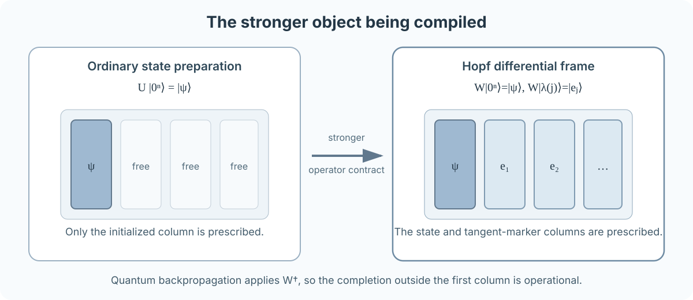

# Optimal Compilation of Hopf Differential Frames

### A linear technical narrative from state preparation to compiler-robust quantum backpropagation

[Landing page](README.md) · [Minimal Hopf interface](docs/HOPF_INTERFACE.md) · [Complete compiler proof](docs/COMPILER_THEOREM.md) · [Verification](docs/VERIFICATION.md)

## Orientation

Yuan and Zhang determine the optimal exact circuit size and depth for preparing
one arbitrary `n`-qubit state with any number `m` of clean ancillary qubits. If
`N=2^n`, their frontier is

```math
S_{\mathrm{QSP}}(n,m)=\Theta(N),
```

```math
D_{\mathrm{QSP}}(n,m)
=\Theta\left(n+\frac{N}{n+m}\right).
```

This repository asks a stronger synthesis question.

The Hopf construction is a binary-tree coordinate chart for arbitrary real and
complex pure states. Besides preparing a state, it supplies canonical
coordinate directions. These directions occupy designated columns of a unitary
`W`, the **Hopf differential frame**:

```math
W|0^n\rangle=|\psi\rangle,
\qquad
W|\lambda(j)\rangle=|e_j\rangle.
```

The global Hopf quantum-backpropagation protocol applies `W^dagger` to a common
objective response. It therefore depends on the complete frame action, not only
on the prepared state column.

The main result under technical review is that this stronger object reaches the
same size–depth frontier as arbitrary state preparation. For the real frame and
the phase-dressed complex magnitude frame,

```math
\boxed{
S_{\mathbb R}(n,m)
=S_{\mathbb C,\mathrm{mag}}(n,m)
=\Theta(N),
}
```

```math
\boxed{
D_{\mathbb R}(n,m)
=D_{\mathbb C,\mathrm{mag}}(n,m)
=\Theta\left(n+\frac{N}{n+m}\right),
\qquad m\geq0.
}
```

The result is exact in the all-to-all logical model with arbitrary one-qubit
gates and CNOTs. It has passed internal analytic and executable checks and is
presented for independent technical review.

The argument has five conceptual steps:

1. identify the complete frame operator and show why one state column is
   insufficient;
2. exploit the addressed zero-suffix structure of each Hopf depth;
3. close strict zero workspace by borrowing and exactly restoring one logical
   suffix qubit;
4. trade positive workspace for coherent branch parallelism below a tree cut;
5. transfer the optimal frame compiler to the complex magnitude frame and the
   global QBP record.

<p align="center">
  
</p>

---

## 1. The synthesis problem in compiler language

### 1.1 State preparation fixes one column

Ordinary exact state preparation asks for a unitary `U_prep` satisfying

```math
U_{\mathrm{prep}}|0^n\rangle=|\psi\rangle.
```

Its action on the orthogonal complement of `|0^n>` is free. That freedom is
valuable: the compiler may choose any convenient unitary completion while
optimizing size, depth, or workspace.

The Hopf frame removes much of that freedom. Its first column is the state, but
selected nonzero computational columns are canonical coordinate directions.
Those columns are operational because the reverse gradient circuit applies the
inverse frame and reads their computational markers.

<p align="center">
  
</p>

### 1.2 Frame-safe compilation

Let `J` append `m` clean workspace qubits:

```math
J|\varphi\rangle
=|\varphi\rangle|0^m\rangle.
```

A compiled circuit `W_tilde` is **frame-safe** when

```math
\boxed{
\widetilde WJ=JW
}
```

for every system input. It must be unitary on the complete system–workspace
space.

This identity also gives the inverse contract. The clean-workspace subspace is
mapped onto itself and is therefore reducing for the unitary `W_tilde`. Hence

```math
\widetilde W^{\dagger}J=JW^{\dagger}.
```

The global gradient circuit can replace `W` and `W^dagger` by a frame-safe
implementation without changing either coherent branch or the final
measurement distribution.

### 1.3 Why this is not generic unitary synthesis

A generic `n`-qubit unitary has `Theta(4^n)` continuous parameters. The real
Hopf frame is an `N`-by-`N` unitary determined by only `N-1` magnitude angles.
The phase-dressed complex magnitude frame adds `N` leaf phases. Its special tree
structure makes state-preparation-order synthesis possible.

Treating all `N` columns as an arbitrary controlled-state-preparation problem
would introduce an `n`-qubit column index and an `n`-qubit target, producing the
generic scale `O(2^(n+n))=O(N^2)`. The present construction avoids that route.

> **What should be checked here?** Confirm that frame safety is an equality on
> all clean-workspace system inputs. Check that inverse correctness follows from
> a reducing subspace, not from taking the adjoint of a first-column equality.

### Executable counterpart

- [Frame-safe compiler contracts](docs/FRAME_SAFE_COMPILATION.md)
- [Exact counterexamples to weaker contracts](docs/COMPILER_BOUNDARIES.md)
- [Boundary implementation](compiler_robust_hopf/compiler_boundaries.py)
- [Boundary tests](tests/test_compiler_boundaries.py)

---

## 2. Minimal Hopf interface

### 2.1 Binary-tree coordinates

Fix `n` qubits and `N=2^n`. The real Hopf chart assigns one angle to every
internal node of a complete binary tree. The root angle splits amplitude between
the two halves of the computational basis; descendant angles recursively split
the amplitude entering their subtrees.

For internal node `j` at depth `d` and position `r`,

```math
j=2^d+r,
\qquad
0\leq r<2^d.
```

Its computational marker is

```math
\lambda(j)=(2r+1)2^{n-d-1}.
```

The marker bit string is the node prefix, followed by a one at the node target,
followed by zeros below it.

### 2.2 Oriented incoming amplitude and metric

Let `a_j(theta)` be the product of sine and cosine factors selected along the
path from the root to node `j`. For unrestricted real angles, `a_j` is oriented
and may be negative. Differentiating the split at node `j` yields

```math
\boxed{
\partial_{\theta_j}|\psi\rangle
=a_j|e_j\rangle,
\qquad
g_{j,j}=a_j^2.
}
```

The principal square root is `sqrt(g_(j,j))=|a_j|`.

The canonical domains remove this sign ambiguity:

- in the real chart, depths `0,...,n-2` use `[0,pi/2]`, while the final depth
  uses `[0,2pi)` to encode leaf signs;
- in the complex chart, every magnitude angle uses `[0,pi/2]`, and leaf phases
  encode complex signs.

Only ancestor angles enter `a_j`, so on the canonical domains

```math
a_j\geq0,
\qquad
a_j=\sqrt{g_{j,j}}.
```

At a regular coordinate, `g_(j,j)>0`, `|e_j>` is the normalized derivative
direction. At a singular coordinate, `g_(j,j)=0`, the raw differential vanishes.
The unit vector occupying the marker column remains a canonical orthogonal
continuation of the frame; it is not normalization of a nonzero derivative.

The real differential frame is

```math
W_{\mathbb R}|0^n\rangle=|\psi_{\mathbb R}\rangle,
```

```math
W_{\mathbb R}|\lambda(j)\rangle=|e_j^{\mathbb R}\rangle.
```

### 2.3 Complete addressed layers

At tree depth `d`, split a basis label as

```math
|p\rangle_P|x\rangle_T|z\rangle_Z,
```

where `p` is the `d`-bit prefix, `x` is the target, and the lower suffix `z` has
length `s=n-d-1`.

The complete depth operator is

```math
\boxed{
L_d^{(n)}
=I+
\sum_{p=0}^{2^d-1}
|p\rangle\!\langle p|
\otimes
\bigl(R_y(\theta_{d,p})-I\bigr)
\otimes
|0^s\rangle\!\langle0^s|.
}
```

The convention is

```math
R_y(\alpha)=e^{-i\alpha Y}
=
\begin{pmatrix}
\cos\alpha&-\sin\alpha\\
\sin\alpha&\cos\alpha
\end{pmatrix}.
```

The complete frame is

```math
W_{\mathbb R}^{(n)}
=L_{n-1}^{(n)}\cdots L_1^{(n)}L_0^{(n)},
```

with `L_0` acting first.

The zero-suffix condition is the central compiler feature. It ensures that an
addressed rotation acts only on its state-and-complement pair and fixes all
other established columns.

### 2.4 Phase-dressed complex magnitude frame

Attach one phase `phi_l` to each leaf:

```math
D_{\mathrm{ph}}
=\sum_{\ell=0}^{N-1}
e^{i\phi_\ell}|\ell\rangle\!\langle\ell|.
```

The unitary used by the complex magnitude stream is

```math
W_{\mathbb C,\mathrm{mag}}
=D_{\mathrm{ph}}W_{\mathbb R}.
```

It contains the complex state and the `N-1` phase-dressed magnitude directions.
The `N` leaf-phase derivatives are a separate direct measurement stream and
cannot all be additional columns of the same `N`-dimensional unitary.

> **What should be checked here?** Verify the breadth-first marker convention,
> the state-update order, the identity action on every nonzero-suffix sector,
> the canonical domains, and the distinction between a regular normalized
> derivative and a singular frame continuation.

### Executable counterpart

- [Minimal Hopf interface and notation](docs/HOPF_INTERFACE.md)
- [Marker conventions](compiler_robust_hopf/conventions.py)
- [State, oriented differentials, and frames](compiler_robust_hopf/frames.py)
- [Frame and chart-domain tests](tests/test_frames.py)

---

## 3. Two qubits: the complete obstruction in one example

For two qubits,

```math
|\psi\rangle
=
\cos\theta_1
\bigl(\cos\theta_2|00\rangle+
      \sin\theta_2|01\rangle\bigr)
+
\sin\theta_1
\bigl(\cos\theta_3|10\rangle+
      \sin\theta_3|11\rangle\bigr).
```

At

```math
\theta_1=\theta_2=\theta_3=\frac{\pi}{4},
```

we have

```math
|\psi\rangle
=\frac{|00\rangle+|01\rangle+|10\rangle+|11\rangle}{2}.
```

The marker assignment is

```math
\lambda(1)=10_2,
\qquad
\lambda(2)=01_2,
\qquad
\lambda(3)=11_2.
```

In computational column order, the canonical frame is

```math
W_{\mathbb R}
=
\begin{pmatrix}
\frac12&-\frac1{\sqrt2}&-\frac12&0\\[3pt]
\frac12& \frac1{\sqrt2}&-\frac12&0\\[3pt]
\frac12&0&\frac12&-\frac1{\sqrt2}\\[3pt]
\frac12&0&\frac12& \frac1{\sqrt2}
\end{pmatrix}
=
\begin{pmatrix}
|&|&|&|\\
\psi&e_2&e_1&e_3\\
|&|&|&|
\end{pmatrix}.
```

Let `Q` swap `|01>` and `|10>` while fixing `|00>` and `|11>`, and set

```math
V=W_{\mathbb R}Q.
```

Then

```math
V|00\rangle=W_{\mathbb R}|00\rangle=|\psi\rangle,
```

so `V` prepares exactly the same state, but it exchanges two marker columns.

Choose

```math
O=-Z\otimes I.
```

Direct calculation gives

```math
W_{\mathbb R}^{\dagger}O|\psi\rangle=|10\rangle,
```

while

```math
V^{\dagger}O|\psi\rangle=|01\rangle.
```

The unchanged marker decoder consequently changes the gradient from

```math
(2,0,0)
```

to

```math
(0,\sqrt2,0).
```

<p align="center">
  
</p>

```math
\boxed{
V|0^n\rangle=W|0^n\rangle
\not\Rightarrow
\text{valid inverse-frame gradient decoding}.
}
```

This does not say that state-preparation compilers are unsuitable. It says that
a compiler inserted into this reverse protocol must preserve the columns the
protocol resolves.

### Executable counterpart

- [Counterexample code](compiler_robust_hopf/compiler_boundaries.py)
- [Exact distributions and gradients](tests/test_compiler_boundaries.py)

---

## 4. Circuit framework and literature position

The sole active external compiler framework is Yuan and Zhang, *Quantum* **7**,
956 (2023). The proof imports four statements.

| Result | Use in this repository |
|---|---|
| Theorem 2 | optimal arbitrary-state-preparation frontier for every `m` |
| Lemma 5 | exact ancilla-free multi-controlled X with linear size and depth |
| Lemma 6 | exact total-width-`q` UCG with `O(2^q)` size and `O(q+2^q/(q+w))` depth using `w` clean qubits |
| Lemma 9 | coherent CNOT-tree copy–use–uncopy |

The published article is `arXiv:2202.11302v2`. The imported statements were
also checked in v3 and retain the forms used here.

The earlier Sun–Tian–Yang–Yuan–Zhang paper is the historical predecessor. The
Möttönen–Bergholm work supplies the multiplexor/UCG language. The relationship
is:

> The state-preparation results can be adapted after the complete-operator
> structure of the Hopf frame is exposed. The adaptation is not direct because
> the frame preserves a state and designated marker columns, whereas ordinary
> state preparation fixes one initialized column.

The strict-zero circuit also uses familiar controlled-unitary square-root and
borrowed-workspace ideas. The narrow claim is the Hopf-specific reduction of an
addressed depth to two smaller UCGs plus linear predicate toggles. Borrowed
qubits, toggle detection, square-root decompositions, and UCGs are not claimed
as new.

### Exact dependency map

- [Fact-level source map](docs/SOURCE_MAP.md)
- [Related work and contribution boundary](docs/RELATED_WORK.md)

---

## 5. Main theorem and schedule map

For every integer `m>=0`, the compiler selects one of three schedules.

| Workspace | Schedule | Core operation |
|---:|---|---|
| `m=0` | borrowed-suffix half-angle echo | recognize the zero-suffix sector without an ancillary wire |
| `1<=m<4n` | direct flagged UCG | compute one reusable suffix predicate flag |
| larger `m` | routed parallel subframes | exchange workspace for coherent branch parallelism below a tree cut |

The upper-bound target is

```math
S(n,m)=O(N),
```

```math
D(n,m)=O\left(n+\frac{N}{n+m}\right),
```

and the real-state family supplies matching lower bounds.

---

## 6. Strict zero workspace: borrowed-suffix echo

### 6.1 Why direct sparse Möttönen pruning is insufficient

At depth `d`, the logical table is

```math
\alpha(p,z)=\theta_{d,p}[z=0].
```

Only `2^d` of the `2^(n-1)` blocks are nontrivial. Yet the standard
Möttönen/Gray-code physical angles are obtained through a signed Walsh
transform. For prefix frequency `u` and suffix frequency `v`,

```math
\widehat\alpha(u,v)
\propto
\sum_{p,z}(-1)^{u\cdot p+v\cdot z}
\theta_{d,p}[z=0]
=
\sum_p(-1)^{u\cdot p}\theta_{d,p}.
```

The result is independent of `v`, so generic prefix coefficients repeat across
all suffix frequencies. Logical sparsity does not become sparse physical
Möttönen angles.

### 6.2 Exact echo

For `d<n-1`, write the suffix as borrowed bit `b` and remaining string `r`.
Define

```math
h(r)=[r=0],
\qquad
C_p=R_y(\theta_{d,p}/2).
```

Let `T_h` toggle `b` iff `r=0`. Apply from left to right:

```text
controlled_b(X)
T_h
controlled_b(C_p)
T_h
controlled_b(X)
T_h
controlled_b(C_p)
T_h.
```

<p align="center">
  
</p>

Because

```math
C_p^2=R_y(\theta_{d,p}),
\qquad
XC_pX=C_p^{-1},
```

the complete sector table is:

| `h(r)` | original `b` | chronological target word | net action | final `b` |
|---:|---:|---|---|---:|
| 0 | 0 | none | `I` | 0 |
| 0 | 1 | `X,C_p,X,C_p` | `C_pXC_pX=I` | 1 |
| 1 | 0 | `C_p,C_p` | `R_y(theta_(d,p))` | 0 |
| 1 | 1 | `X,X` | `I` | 1 |

The desired addressed rotation occurs exactly when the original complete suffix
is zero. Every other sector receives identity. The borrowed logical qubit is
restored and no relative phase appears. Orthogonality of the sectors extends
the equality to arbitrary superpositions and entangled inputs.

### 6.3 Resource sum

Each half-angle operation is one UCG on `d` prefix controls, borrowed control
`b`, and the target, so its total width is

```math
q=d+2.
```

The four predicate toggles are ancilla-free multi-controlled X gates. Hence

```math
S(L_d)=O(2^d+n-d),
```

```math
D(L_d)=O\left(n+\frac{2^d}{d+2}\right).
```

The final depth is one ordinary `n`-qubit UCG. Summing gives

```math
S_{\mathbb R}(n,0)=O(N),
```

```math
D_{\mathbb R}(n,0)
=O\left(n+\frac{N}{n}\right).
```

> **What should be checked here?** Check the original value of the borrowed
> bit, chronological product order, absence of branch phases, exact UCG width
> `d+2`, and the no-ancilla convention of Lemma 5.

### Executable counterpart

- [Strict-zero construction](compiler_robust_hopf/strict_zero_echo.py)
- [Complete operator tests](tests/test_strict_zero_echo.py)
- [Exact-rational resource checks](compiler_robust_hopf/strict_zero_audit.py)

---

## 7. Small positive workspace: direct flagged UCGs

With one clean qubit available, the common zero-suffix predicate can be stored
directly. At every nonfinal depth:

1. compute `[z=0]` into one clean flag;
2. apply one UCG selected by the `d` prefix bits and the flag;
3. uncompute the flag.

The UCG receives only the remaining `m-1` clean work qubits. The final depth has
no suffix predicate and may use all `m`.

Predicate calculations total `O(n^2)` size and depth. UCG sizes form a geometric
series and total `O(N)`. Lemma 6 gives

```math
D_{\mathrm{direct}}(n,m)
=O\left(n^2+\frac{N}{n+m}\right).
```

For `1<=m<4n`, the exponential term absorbs `n^2`, so

```math
S_{\mathrm{direct}}(n,m)=O(N),
```

```math
D_{\mathrm{direct}}(n,m)
=O\left(n+\frac{N}{n+m}\right).
```

> **What should be checked here?** Count the predicate flag inside the
> requested budget and give the UCG only `m-1` additional work qubits. Verify
> exact uncomputation before the next depth.

---

## 8. Larger workspace: cut, route, and parallelize

### 8.1 Tree-cut identities

Cut after `t` depths and set

```math
B=2^t,
\qquad
s=n-t.
```

Write

```math
W_{\mathbb R}^{(n)}=R_t^{(n)}F_t^{(n)}.
```

The prefix identity is

```math
\boxed{
F_t^{(n)}
=W_{\mathbb R}^{(t)}\otimes|0^s\rangle\!\langle0^s|
+I\otimes\left(I-|0^s\rangle\!\langle0^s|\right).
}
```

Every layer above the cut contains all external suffix qubits in its
zero-suffix predicate. The layers form `W_R^(t)` on `|0^s>` and are identity on
the orthogonal complement.

For each prefix `r`, let `W_s^(r)` be the complete Hopf frame below that prefix.
Every tail layer preserves the prefix, so

```math
\boxed{
R_t^{(n)}
=\bigoplus_{r=0}^{B-1}W_s^{(r)}.
}
```

<p align="center">
  
</p>

### 8.2 Conditioned prefix

An explicit reversible decoder converts the `t`-bit prefix to a one-hot label:

```math
D_t|x\rangle|0\cdots0\rangle
=|0^t\rangle|e_x\rangle|0\cdots0\rangle.
```

For `B=2^t`, it uses

```math
3B-2-t
```

clean workspace qubits, depth `11t-4=O(t)`, and size `O(B)`. Its X/CNOT/Toffoli
layers are explicit and disjoint. On the one-hot code, all Givens pairs at one
Hopf depth are disjoint, so the conditioned prefix has

```math
S(F_t)=O(B+s),
\qquad
D(F_t)=O(n).
```

### 8.3 Explicit coherent router

The router allocates `B` possible suffix-data locations and `B` one-hot tokens.
Branch zero is the original `s`-qubit suffix; the other branches use `(B-1)s`
clean data wires. The root token begins in one.

Treat each branch's suffix and token as a block of width `s+1`. At routing level
`j`, the `j`-th prefix bit controls `2^j(s+1)` simultaneous Fredkin gates. One
original control is available, so the number of clean copies is

```math
2^j(s+1)-1.
```

Summing over `j=0,...,t-1` gives

```math
\boxed{
(B-1)(s+1)-t
}
```

copy wires. Balanced CNOT fanout trees for distinct prefix bits run
concurrently. Fredkin levels are then applied from the least significant prefix
bit to the most significant. At one level every gate is disjoint.

The forward Fredkin count is

```math
\boxed{
(B-1)(s+1).
}
```

The resulting coherent action is

```math
\sum_r c_r|r\rangle_P|\xi_r\rangle_X|0\rangle_{\mathrm{work}}
\longmapsto
\sum_r c_r|r\rangle_P
|\xi_r\rangle_{X_r}|1\rangle_{z_r}|0\rangle_{\mathrm{rest}}.
```

This holds when prefix and suffix are entangled because the router is a
controlled permutation, not a measurement-conditioned process.

After routing, all prefix copies are uncomputed. Their clean wires are reused as
one local suffix-predicate flag per branch. Token `z_r` controls the complete
subtree frame `W_s^(r)`. The branch circuits act on disjoint data, token, and
flag registers and therefore run in parallel. Every flag is uncomputed; prefix
copies are recomputed; Fredkin levels are reversed; copies are cleared; and the
root token is reset.

The explicit construction and sparse-state simulator are in
[`router.py`](compiler_robust_hopf/router.py). Tests compare the full
route–controlled-subframes–unroute action with the ideal direct sum on arbitrary
complex inputs and verify zero token, flag, copy, and data-workspace leakage.

### 8.4 Workspace peak

The routed-tail registers are:

| Register | Clean qubits |
|---|---:|
| additional branch data | `(B-1)s` |
| activation tokens | `B` |
| copied routing controls | `(B-1)(s+1)-t` |
| simultaneous branch flags | `B` when `s>1`, reusing cleared copy wires |

The tail peak is

```math
(B-1)s+B+
\max\{(B-1)(s+1)-t,\,B\}.
```

The prefix and tail execute sequentially, so their peaks take a maximum. Both
fit inside

```math
\boxed{
2B(s+1).
}
```

### 8.5 Parallel subframes and cut choice

One token-controlled direct `s`-qubit subframe has

```math
S_{\mathrm{csub}}(s)=O(2^s),
```

```math
D_{\mathrm{csub}}(s)
=O\left(s^2+\frac{2^s}{s}\right).
```

The `B` branches have total size `B O(2^s)=O(N)` and the depth of one branch.
Routing contributes `O(B(s+1))=O(N)` size and `O(n)` depth.

For `m>=4n`, choose the largest `t` satisfying

```math
2\,2^t(n-t+1)\leq m.
```

If `s=n-t>1`, failure of the next cut yields `m<4*2^t*s`, and therefore

```math
\frac{2^s}{s}
=\frac{N}{2^t s}
=O\left(\frac{N}{n+m}\right).
```

Also `s^2=O(n+2^s/s)`. Hence

```math
S_{\mathrm{routed}}(n,m)=O(N),
```

```math
D_{\mathrm{routed}}(n,m)
=O\left(n+\frac{N}{n+m}\right).
```

> **What should be checked here?** Verify the two operator identities before
> auditing resources. Then inspect the binary-address clearing, explicit
> Fredkin routing on entangled inputs, simultaneous register peak, flag reuse,
> branch disjointness, and maximal-cut inequality.

### Executable counterpart

- [Tree identities](compiler_robust_hopf/tree_structure.py)
- [Binary–one-hot decoder](compiler_robust_hopf/tree_decoder.py)
- [Explicit coherent router](compiler_robust_hopf/router.py)
- [Router operator and cleanup tests](tests/test_router.py)
- [Resource selection](compiler_robust_hopf/unified_compiler.py)

---

## 9. Matching lower bounds

Every valid frame compiler is a real-state-preparation circuit on
`|0^n>|0^m>` because its first column ranges over an open family of real
normalized states of dimension `N-1`.

### 9.1 Size

A circuit with `G` arbitrary one-qubit gates has only `O(G)` continuous
parameters. A countable collection of lower-dimensional circuit families cannot
cover an open subset of the real sphere. Hence

```math
S_{\mathbb R}(n,m)=\Omega(N).
```

### 9.2 Workspace-dependent depth

A depth-`D` circuit on `n+m` wires has `O(D(n+m))` parameterized one-qubit gate
locations, so

```math
D=\Omega\left(\frac{N}{n+m}\right).
```

### 9.3 Linear depth

Each of the `n` system outputs has a backward light cone of at most `2^D` wires.
The union contains `O(n2^D)` relevant wires and `O(Dn2^D)` continuously
parameterized locations. Covering the real-state family requires

```math
Dn2^D=\Omega(2^n),
```

which implies `D=Omega(n)`. At `m=0`, `Omega(N/n)` already dominates `n`.

Thus

```math
D_{\mathbb R}(n,m)
=\Omega\left(n+\frac{N}{n+m}\right).
```

The lower bound uses only the first frame column, so it applies to every
complete-frame compiler. Together with the three schedules it proves the real
frame theorem.

---

## 10. Phase-dressed complex magnitude frame

Choose the final system qubit as a UCG target and write a basis label as `x=zb`.
Then

```math
D_{\mathrm{ph}}
=
\sum_z|z\rangle\!\langle z|
\otimes
\begin{pmatrix}
e^{i\phi_{z0}}&0\\
0&e^{i\phi_{z1}}
\end{pmatrix}.
```

This is one exact total-width-`n` UCG, including common phase. Lemma 6 gives

```math
S_{\mathrm{diag}}(n,m)=O(N),
```

```math
D_{\mathrm{diag}}(n,m)
=O\left(n+\frac{N}{n+m}\right)
```

for every `m>=0`.

The real frame and phase UCG execute sequentially and both return workspace
clean, so they reuse one pool. The real subfamily supplies matching lower
bounds. Therefore

```math
S_{\mathbb C,\mathrm{mag}}(n,m)=\Theta(N),
```

```math
D_{\mathbb C,\mathrm{mag}}(n,m)
=\Theta\left(n+\frac{N}{n+m}\right).
```

The full complex coordinate gradient combines this magnitude-frame stream with
the separate direct leaf-phase stream.

---

## 11. Quantum-backpropagation consequence

### 11.1 Pulling the objective response into the frame

For

```math
E_O(\boldsymbol\theta)
=\langle\psi|O|\psi\rangle,
```

the unrestricted-angle differential identity gives

```math
\partial_{\theta_j}E_O
=2a_j\,\mathrm{Re}
\langle\lambda(j)|W^{\dagger}O|\psi\rangle.
```

On the canonical chart, `a_j=sqrt(g_(j,j))`. A phase-calibrated controlled
Hermitian-unitary observable creates coherent reference and response branches.
Applying `W^dagger` maps the reference branch to `|0^n>` and resolves the
response in the computational frame.

For an all-X outcome `(b,y)`, the canonical raw-coordinate record is

```math
Z_j
=2\sqrt{g_{j,j}}
(-1)^{b+\lambda(j)\cdot y}.
```

The same outcome contributes to every magnitude coordinate. A signed histogram
and one fast Walsh–Hadamard transform evaluate all marker parities together.
The best of the record-wise and histogram decoders uses

```math
O\left(S+N\min\{S,n\}\right)
```

classical operations for `S` outcomes.

### 11.2 Statistical target

The primary finite-shot claim is simultaneous absolute accuracy of the **raw
Hopf-coordinate gradient**. Fixed-norm concentration gives

```math
S_{\nabla,\infty}
=O\left(
\frac{1+\log(n/\delta)}{\varepsilon_{\infty}^2}
\right).
```

At fixed `epsilon_infinity` and `delta`, this is `O(log n)=O(log log M)` for
`M=Theta(N)` coordinates.

This does not imply the same count for complete-vector `l_2`, relative,
normalized-frame, or natural-gradient accuracy. Small metric weights suppress
raw records but condition outputs that divide by `sqrt(g_(j,j))` or `g_(j,j)`.
At `g_(j,j)=0`, the raw differential and raw record vanish.

### 11.3 Matched-program runtime statement

Define a matched scalar program and gradient program using the same forward
preparation and controlled observable:

```math
T_{\mathrm{scalar}}^{\mathrm{matched}}
=S_E(D_{\mathrm{prep}}+D_O),
```

```math
T_{\mathrm{grad}}^{\mathrm{matched}}
=S_{\nabla}(D_{\mathrm{prep}}+D_O+D_{\mathrm{frame}}).
```

For the general state family,

```math
D_{\mathrm{prep}}
=\Theta\left(n+\frac{N}{n+m}\right),
```

and the present theorem gives the same order for `D_frame` for every `m>=0`.
Thus the inverse frame changes per-execution depth by a constant asymptotic
factor. At fixed comparable absolute-accuracy and confidence conventions,

```math
\boxed{
\frac{T_{\mathrm{grad}}^{\mathrm{matched}}}
     {T_{\mathrm{scalar}}^{\mathrm{matched}}}
=O(\log n)
=O(\log\log M).
}
```

This is not a comparison with an instance-specialized scalar circuit and does
not include materializing the `M`-entry classical output.

### 11.4 Frame-safe substitution

If

```math
\widetilde WJ=JW,
```

then

```math
\widetilde W^{\dagger}J=JW^{\dagger}.
```

The compiled circuit reproduces the same reference and response branches on the
clean-workspace subspace. The complete distribution, decoded means, record
norms, and concentration premises are unchanged.

Checkpoint methods use an active-interface contract rather than the complete
global frame and must be analyzed separately.

> **What should be checked here?** Keep executions, logical depth, output size,
> requested accuracy, and controlled-observable cost separate. Verify that the
> fixed decoder sees the same marker columns after compilation.

### Executable counterpart

- [Complete QBP consequence](docs/QBP_CONSEQUENCE.md)
- [Magnitude and phase decoders](compiler_robust_hopf/decoders.py)
- [Decoder tests](tests/test_decoders.py)

---

## 12. Verification and implementation levels

The theorem is supported by exact finite checks, not inferred from them.

The repository represents different components at appropriate levels:

| Component | Representation |
|---|---|
| Hopf frames and strict-zero echo | complete dense logical matrices |
| binary–one-hot decoder | explicit X/CNOT/Toffoli layers |
| coherent router | explicit CNOT-fanout/Fredkin layers and sparse complex-state simulation |
| token-controlled subtree frames | exact logical UCG block action with explicit flag cleanup |
| UCG and multi-controlled-X elementary synthesis | imported Yuan–Zhang theorems |
| resource theorem | integer and exact-rational ledgers |

The explicit routed tests check arbitrary prefix–suffix-entangled inputs,
complete route–operate–unroute action, and zero workspace leakage. Toffoli,
Fredkin, and controlled one-qubit gates have constant-size exact decompositions
in the declared arbitrary-one-qubit+CNOT model.

The most useful first command is

```bash
python scripts/reviewer_walkthrough.py
```

and the complete suite is

```bash
python validate.py
```

Detailed evidence appears in [Verification and evidence](docs/VERIFICATION.md).

Three internal review records remain visible:

| Record | Purpose |
|---|---|
| [Consolidated proof audit](docs/PROOF_AUDIT.md) | register and all-workspace asymptotic accounting |
| [Strict-zero audit](docs/STRICT_ZERO_ECHO_AUDIT.md) | sector order, restoration, endpoints, and hidden-workspace check |
| [Clean-room reconstruction](docs/CLEAN_ROOM_ALL_WORKSPACE_REVIEW.md) | theorem re-derived from operator definitions rather than development chronology |

These records are checking evidence, not external verification.

---

## 13. Source and contribution boundaries

### Inherited from the Hopf papers

- balanced real and complex Hopf charts and canonical domains;
- diagonal metric and oriented differential identity;
- marker-column frame;
- global, phase, and checkpoint gradient records;
- statistical task boundaries and concentration statements.

### Imported from Yuan–Zhang

- optimal QSP benchmark;
- ancilla-free multi-controlled X;
- all-workspace UCG tradeoff;
- coherent copy–uncopy.

### Proved in this repository

- frame-safe substitution and compiler hierarchy;
- state-column obstruction;
- strict-zero borrowed-suffix echo;
- conditioned-prefix and tail direct-sum structure;
- self-contained binary–one-hot decoder;
- explicit coherent router and routed parallel-subframe compiler;
- optimal all-workspace real-frame theorem;
- phase-dressed complex magnitude-frame corollary;
- matched-program compiler-robust QBP consequence.

The exact source versions and local consumers are in
[the source map](docs/SOURCE_MAP.md).

---

## 14. Scope exclusions

The theorem is an exact logical synthesis result. It does not presently cover:

- restricted device connectivity or SWAP routing;
- native hardware gate sets;
- approximate Clifford+T synthesis and T-depth;
- coherent or stochastic hardware noise;
- readout mitigation;
- a universal cost model for controlled observable access;
- arbitrary non-Hopf charts or generic structured unitaries;
- optimizer convergence;
- optimal finite constants among the three schedules.

These are separate compiler, hardware, or application layers.

---

## 15. Central technical questions for review

1. Does the addressed-layer product realize the claimed real Hopf frame with the
   stated marker convention and canonical-domain interpretation?
2. Does the two-qubit example establish that state-column equality is too weak
   for the global decoder?
3. Does the strict-zero echo implement every nonfinal addressed layer and
   restore the borrowed logical qubit without phase?
4. Are Lemmas 5, 6, and 9 used with the correct total-width and workspace
   conventions in both published v2 and checked v3?
5. Is the binary–one-hot decoder reversible, clean, and correctly counted?
6. Does the explicit router work on arbitrary prefix–suffix entanglement and
   return data, tokens, copies, and flags correctly?
7. Does the peak workspace fit in `2B(s+1)` and within the selected budget?
8. Do the low-workspace absorption and maximal-cut inequalities cover every
   `m>=0` endpoint?
9. Do the parameter-count and light-cone arguments give the matching real-state
   lower bound?
10. Does the one-UCG diagonal establish the phase-dressed complex magnitude
    result with sequential workspace reuse?
11. Does frame-safe substitution preserve the complete global QBP distribution
    under the stated raw-coordinate accuracy and controlled-observable model?
12. Is the contribution boundary relative to state preparation, UCGs, and
    borrowed-workspace techniques stated accurately and generously?

---

## Reading onward

- [Minimal Hopf interface](docs/HOPF_INTERFACE.md)
- [Complete all-workspace compiler proof](docs/COMPILER_THEOREM.md)
- [Quantum-backpropagation consequence](docs/QBP_CONSEQUENCE.md)
- [Verification and evidence](docs/VERIFICATION.md)
- [Fact-level source map](docs/SOURCE_MAP.md)
- [Related work and contribution boundary](docs/RELATED_WORK.md)

[Back to the landing page](README.md)
