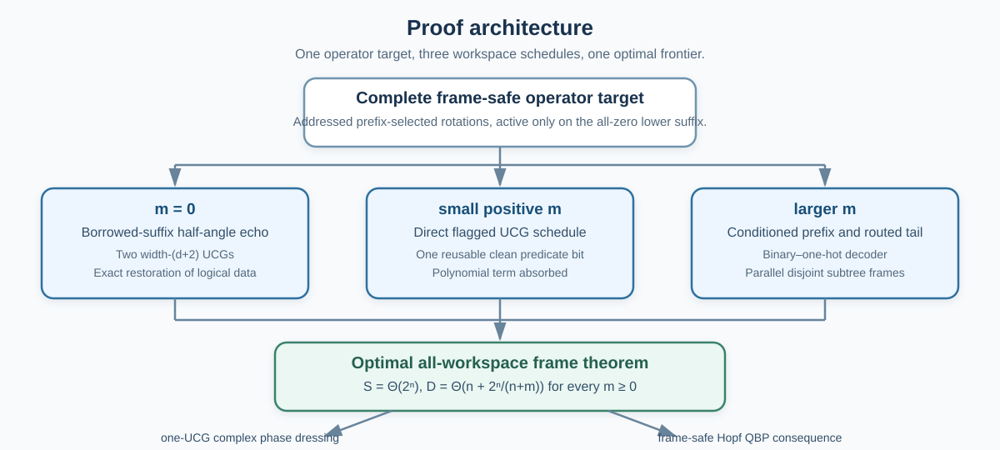

# Optimal Compilation of Hopf Differential Frames

### A linear technical note from structured state-preparation completion to quantum backpropagation

[Landing page](README.md) · [Short reading guide](docs/READING_GUIDE.md) · [Minimal Hopf interface](docs/HOPF_INTERFACE.md) · [Complete compiler proof](docs/COMPILER_THEOREM.md) · [Verification](docs/VERIFICATION.md)

## How to read this note

The compiler theorem is logically independent of the downstream
quantum-backpropagation application. Sections 1–10 define the operator task,
construct the circuits, and prove the optimal size–depth frontier. Section 11
then explains why this complete-operator result preserves the Hopf gradient
record.

A reader familiar with exact quantum state preparation can therefore treat the
Hopf material as a compact structural interface rather than as a prerequisite
optimization theory.

<p align="center">
  
</p>

---

## 1. A structured unitary-completion problem

### 1.1 Four nearby synthesis tasks

Fix `n` system qubits and write

```math
N=2^n.
```

The present problem is easiest to locate by comparing four operator
specifications.

| Task | Required action | Freedom outside the requirement |
|---|---|---|
| Quantum state preparation | `U|0^n>=|psi>` | all other columns of `U` are free |
| Controlled state preparation | `|i>|0^n> -> |i>|psi_i>` | action outside the indexed preparation subspace is free |
| **Hopf differential-frame compilation** | `W|0^n>=|psi>` and `W|lambda(j)>=|e_j>` for every frame marker | the logical frame is fixed, but belongs to an `O(N)`-parameter tree family |
| General unitary synthesis | `|x> -> U|x>` for every basis label | no structural promise |

The Hopf task fixes a complete unitary, as general unitary synthesis does, but
its parameter count and recursive structure are of state-preparation order.
The question is whether the stronger operator specification can retain the
optimal QSP circuit frontier.

### 1.2 Frame-compilation problem

Let `W(theta)` be a Hopf differential frame on `n` system qubits. A compiler is
supplied with `m>=0` clean ancillary qubits. It must produce a unitary
`W_tilde(theta)` such that

```math
\boxed{
\widetilde W(\boldsymbol\theta)
\bigl(|\varphi\rangle|0^m\rangle\bigr)
=
\bigl(W(\boldsymbol\theta)|\varphi\rangle\bigr)|0^m\rangle
}
```

for every system input `|varphi>`.

This is a complete clean-input operator equality. It includes exact workspace
return and is stronger than preparing the first column.

### 1.3 Main theorem

In the exact all-to-all model with arbitrary one-qubit gates and CNOTs, the real
Hopf frame and the phase-dressed complex magnitude frame satisfy

```math
\boxed{
S_{\mathbb R}(n,m)
=S_{\mathbb C,\mathrm{mag}}(n,m)
=\Theta(N)
}
```

and

```math
\boxed{
D_{\mathbb R}(n,m)
=D_{\mathbb C,\mathrm{mag}}(n,m)
=\Theta\left(n+\frac{N}{n+m}\right)
}
```

for every integer `n>=1` and `m>=0`.

Thus the structured complete unitary has the same asymptotic size–depth
frontier as arbitrary state preparation.

<p align="center">
  
</p>

### 1.4 Why the result is not generic unitary synthesis

A general `N`-dimensional unitary has `Theta(N^2)` continuous parameters. The
real Hopf frame has `N-1` magnitude parameters. The phase-dressed complex
magnitude frame adds `N` leaf phases, still only `O(N)` parameters.

A generic controlled-state-preparation treatment of all `N` columns would use
an `n`-qubit column index and an `n`-qubit target. Its natural scale is

```math
O(2^{n+n})=O(N^2).
```

The theorem instead uses the binary-tree relations among the columns and never
materializes a generic list of `N` independent states.

> **Technical checkpoint.** The target is a complete unitary on the logical
> register, but the family is not arbitrary. Both parts of that sentence are
> load-bearing.

### What has been established

The theorem asks for more than QSP and less than unstructured unitary synthesis.
The remainder of the proof is an explicit conversion of the Hopf tree structure
into the same time–space tradeoff already available for state preparation.

---

## 2. Minimal Hopf interface

### 2.1 Balanced binary-tree coordinates

The real Hopf chart assigns one angle to each internal node of a complete
binary tree with `N` leaves. Internal nodes are indexed breadth first. If node
`j` lies at depth `d` and position `r`, then

```math
j=2^d+r,
\qquad
0\leq r<2^d.
```

The root angle divides amplitude between the left and right halves of the
computational basis. Each descendant angle divides the amplitude entering its
subtree. No other geometric property is required by the compiler proof.

### 2.2 Marker columns

The computational marker assigned to node `j=2^d+r` is

```math
\boxed{
\lambda(j)=(2r+1)2^{n-d-1}.
}
```

Its bit string is

```text
node prefix | 1 at the node target | all-zero lower suffix.
```

The real Hopf differential frame is the unitary satisfying

```math
W_{\mathbb R}|0^n\rangle
=|\psi_{\mathbb R}\rangle,
```

```math
W_{\mathbb R}|\lambda(j)\rangle
=|e_j^{\mathbb R}\rangle,
\qquad 1\leq j<N.
```

The first column is the state. The nonzero marker columns are orthonormal frame
directions associated with the magnitude coordinates.

### 2.3 Oriented incoming amplitudes and the metric

Let `a_j(theta)` be the product of sine and cosine factors along the path from
the root to node `j`. For unrestricted real angles, this product is oriented
and may be negative. The exact differential identity is

```math
\boxed{
\partial_{\theta_j}|\psi\rangle
=a_j|e_j\rangle,
\qquad
g_{j,j}=a_j^2.
}
```

The principal metric square root is therefore

```math
\sqrt{g_{j,j}}=|a_j|.
```

The canonical chart domains make the usual positive formula valid:

- real depths `0,...,n-2` use angles in `[0,pi/2]`;
- the final real depth uses `[0,2pi)` to encode leaf signs;
- every complex magnitude angle uses `[0,pi/2]` and the leaf phases encode
  complex signs.

Only ancestor angles enter `a_j`, so on the canonical domains

```math
a_j\geq0,
\qquad
a_j=\sqrt{g_{j,j}}.
```

At a regular coordinate, `g_(j,j)>0`, the column `|e_j>` is the normalized
coordinate derivative direction. At a singular coordinate, `g_(j,j)=0`, the
raw differential vanishes. The same marker column remains a chart-selected
orthogonal continuation determined by the complete parameter tuple. It is not
the normalization of a nonzero derivative.

This singular-coordinate distinction affects the geometric interpretation, not
the unitary compiler target.

### 2.4 Addressed depth operators

At tree depth `d`, split a computational basis label as

```math
|p\rangle_P|x\rangle_T|z\rangle_Z,
```

where `p` is the `d`-bit prefix, `x` is the next qubit and rotation target, and
`z` is the lower suffix of length

```math
s=n-d-1.
```

The complete depth operator is

```math
\boxed{
L_d^{(n)}
=I+
\sum_{p=0}^{2^d-1}
|p\rangle\!\langle p|
\otimes
\bigl(R_y(\theta_{d,p})-I\bigr)
\otimes
|0^s\rangle\!\langle0^s|.
}
```

The convention is

```math
R_y(\alpha)=e^{-i\alpha Y}
=
\begin{pmatrix}
\cos\alpha&-\sin\alpha\\
\sin\alpha&\cos\alpha
\end{pmatrix}.
```

The prefix selects one angle. The target rotates only when the entire lower
suffix is zero. Every nonzero-suffix sector is fixed.

The complete frame is

```math
\boxed{
W_{\mathbb R}^{(n)}
=L_{n-1}^{(n)}\cdots L_1^{(n)}L_0^{(n)},
}
```

with `L_0` acting first.

The lower-suffix predicate is the central compiler feature. It protects columns
created at earlier depths while allowing all `2^d` rotations at one depth to be
expressed as one structured multiplexor.

### 2.5 Complex magnitude frame

Attach one phase `phi_l` to each computational leaf and define

```math
D_{\mathrm{ph}}
=\sum_{\ell=0}^{N-1}
e^{i\phi_\ell}|\ell\rangle\!\langle\ell|.
```

The unitary used by the complex magnitude stream is

```math
\boxed{
W_{\mathbb C,\mathrm{mag}}
=D_{\mathrm{ph}}W_{\mathbb R}.
}
```

It contains the complex state and the `N-1` phase-dressed magnitude directions.
The `N` leaf-phase derivatives are localized in the computational basis and use
a separate direct measurement stream. They cannot all be additional columns of
the same `N`-dimensional unitary.

> **Technical checkpoint.** The compiler proof needs only the marker formula,
> the addressed-layer identity, and the fact that these layers multiply to the
> complete frame. The inverse coordinate map and optimizer are not used.

### Executable counterpart

- [Minimal Hopf interface](docs/HOPF_INTERFACE.md)
- [Marker conventions](compiler_robust_hopf/conventions.py)
- [Recursive state, differentials, and frames](compiler_robust_hopf/frames.py)
- [Independent addressed-layer construction and tests](tests/test_frames.py)

### What has been established

The unfamiliar geometric object has been reduced to a familiar circuit form: a
sequence of UCG-like layers with one shared all-zero suffix predicate. The
compiler theorem begins from this exact operator identity.

---

## 3. Why one correct state column is insufficient

### 3.1 Frame-safe compilation

Let `J` append clean workspace:

```math
J|\varphi\rangle
=|\varphi\rangle|0^m\rangle.
```

A compiled frame is frame-safe when

```math
\boxed{
\widetilde WJ=JW.
}
```

Since `W_tilde` is unitary and maps the clean-workspace subspace onto itself,
that subspace is reducing. Consequently,

```math
\boxed{
\widetilde W^{\dagger}J=JW^{\dagger}.
}
```

The inverse frame may therefore be substituted into the reverse circuit without
changing the logical system state or leaving residual workspace entanglement.

### 3.2 Complete two-qubit obstruction

For two qubits, take

```math
\theta_1=\theta_2=\theta_3=\frac{\pi}{4}.
```

The prepared state is

```math
|\psi\rangle
=\frac{|00\rangle+|01\rangle+|10\rangle+|11\rangle}{2}.
```

The markers are

```math
\lambda(1)=10_2,
\qquad
\lambda(2)=01_2,
\qquad
\lambda(3)=11_2.
```

In computational column order,

```math
W_{\mathbb R}
=
\begin{pmatrix}
\frac12&-\frac1{\sqrt2}&-\frac12&0\\[3pt]
\frac12& \frac1{\sqrt2}&-\frac12&0\\[3pt]
\frac12&0&\frac12&-\frac1{\sqrt2}\\[3pt]
\frac12&0&\frac12& \frac1{\sqrt2}
\end{pmatrix}
=
\begin{pmatrix}
|&|&|&|\\
\psi&e_2&e_1&e_3\\
|&|&|&|
\end{pmatrix}.
```

Let `Q` swap `|01>` and `|10>` while fixing `|00>` and `|11>`, and put

```math
V=W_{\mathbb R}Q.
```

Since `Q|00>=|00>`,

```math
V|00\rangle=W_{\mathbb R}|00\rangle=|\psi\rangle.
```

Thus `V` is an exact preparation completion for the same state, but it exchanges
two marker columns.

Choose

```math
O=-Z\otimes I.
```

Then

```math
W_{\mathbb R}^{\dagger}O|\psi\rangle=|10\rangle,
```

whereas

```math
V^{\dagger}O|\psi\rangle=|01\rangle.
```

The unchanged marker decoder returns

```math
(2,0,0)
```

for the Hopf frame and

```math
(0,\sqrt2,0)
```

for the state-equivalent completion.

<p align="center">
  
</p>

Therefore

```math
\boxed{
V|0^n\rangle=W|0^n\rangle
\not\Rightarrow
\text{valid inverse-frame gradient readout}.
}
```

The point is not that state-preparation compilers are unsuitable. The point is
that the reverse protocol resolves columns that QSP is free to choose, so the
compiler promise must be strengthened before the QSP primitives are used.

### Executable counterpart

- [Compiler contracts](docs/FRAME_SAFE_COMPILATION.md)
- [Global and checkpoint boundaries](docs/COMPILER_BOUNDARIES.md)
- [Exact counterexample implementation](compiler_robust_hopf/compiler_boundaries.py)
- [Distribution and decoded-gradient tests](tests/test_compiler_boundaries.py)

### What has been established

The complete-frame requirement is operational rather than cosmetic. A
first-column theorem cannot be substituted into the inverse-frame circuit until
the remaining marker action is controlled.

---

## 4. Exact circuit framework

### 4.1 Model

All resource statements use standard exact logical circuits consisting of:

- arbitrary one-qubit gates;
- CNOT gates;
- all-to-all logical connectivity;
- clean ancillary qubits initialized in `|0>` and returned exactly to `|0>`.

Toffoli, Fredkin, controlled one-qubit gates, and the fixed-width controlled
Givens rotations used in readable schedules have exact constant-size,
constant-depth decompositions in this model. Their use changes only constants.

### 4.2 Imported state-preparation results

The active framework is P. Yuan and S. Zhang, *Quantum* **7**, 956 (2023). The
published article corresponds to `arXiv:2202.11302v2`; the statements below were
also checked in v3.

| Imported result | Use in this proof |
|---|---|
| Theorem 2 | optimal QSP benchmark `Theta(N)` size and `Theta(n+N/(n+m))` depth |
| Lemma 5 | exact ancilla-free multi-controlled `X` with linear size and depth |
| Lemma 6 | exact total-width-`q` UCG with `O(2^q)` size and `O(q+2^q/(q+w))` depth using `w` clean work qubits |
| Lemma 9 | coherent CNOT-tree copy–use–uncopy |

The earlier state-preparation paper is the historical predecessor and original
source credited for selected primitives. The two papers form one compiler line
for the present purpose. The later theorem supplies the uniform all-workspace
frontier used in every regime.

### 4.3 How the framework is adapted

The imported results solve familiar state-preparation and multiplexor tasks.
The Hopf-specific work is the decomposition that exposes the frame as those
tasks without losing its prescribed columns:

```text
addressed complete-operator layers
        ↓
strict-zero in-place predicate echo
        or
clean suffix flag
        or
conditioned prefix + routed direct-sum tail
        ↓
UCG, MCT, and coherent-copy primitives
```

This is an adaptation of the all-workspace framework to a structured unitary
completion, not an inference from first-column preparation alone.

> **Technical checkpoint.** The external synthesis statements may be treated as
> black boxes. The Hopf layer identities, register allocation, workspace reuse,
> and schedule selection must be checked locally.

### Exact dependency map

- [Fact-level source map](docs/SOURCE_MAP.md)
- [Related work and contribution boundary](docs/RELATED_WORK.md)

---

## 5. One compiler with three schedules

The real-frame compiler dispatches according to the clean workspace budget.

| Budget | Schedule | Structural idea |
|---:|---|---|
| `m=0` | Z: borrowed-suffix echo | use one original suffix bit as a restored predicate carrier |
| `1<=m<4n` | P1: direct flagged UCG | compute the shared suffix predicate into one reusable clean flag |
| larger `m` | P2: routed parallel subframes | cut the tree and exchange workspace for coherent branch parallelism |

The threshold `4n` is chosen to make the asymptotic proof uniform. It is not a
claim about the optimal finite-size crossover.

The complex magnitude compiler appends one phase UCG and reuses the same
workspace pool sequentially.

The next three sections prove the schedules.

---

## 6. Schedule Z: strict zero workspace

### 6.1 Borrow one original suffix bit

Consider a nonfinal depth `d<n-1`. Split the system register as

```math
|p\rangle_P|x\rangle_T|b\rangle_B|r\rangle_R,
```

where:

- `p` is the `d`-bit prefix;
- `x` is the Hopf target;
- `b` is the first bit of the lower suffix;
- `r` contains the remaining `n-d-2` suffix bits.

Define

```math
h(r)=[r=0],
\qquad
C_p=R_y(\theta_{d,p}/2).
```

Let `T_h` toggle the original logical bit `b` exactly when `r=0`:

```math
T_h:
|b\rangle|r\rangle
\longmapsto
|b\oplus h(r)\rangle|r\rangle.
```

Apply the following gates from left to right:

```text
controlled_b(X)
T_h
controlled_b(C_p)
T_h
controlled_b(X)
T_h
controlled_b(C_p)
T_h.
```

<p align="center">
  
</p>

### 6.2 Complete four-sector proof

The rotation convention gives

```math
C_p^2=R_y(\theta_{d,p}),
\qquad
XC_pX=C_p^{-1}.
```

Fix `p` and `r`. The four sectors are:

| `h(r)` | original `b` | chronological target word | resulting target matrix | final `b` |
|---:|---:|---|---|---:|
| 0 | 0 | none | `I` | 0 |
| 0 | 1 | `X,C_p,X,C_p` | `C_pXC_pX=I` | 1 |
| 1 | 0 | `C_p,C_p` | `C_p^2=R_y(theta_(d,p))` | 0 |
| 1 | 1 | `X,X` | `I` | 1 |

The chronological word `X,C_p,X,C_p` acts on column vectors as
`C_pXC_pX`. The unwanted original-`b=1` branch therefore cancels exactly.

The active sector is `h(r)=1` with original `b=0`, which is precisely the
condition that the complete original suffix `br` is zero. Every other sector
receives identity. The borrowed bit is toggled either zero or four times and is
restored exactly. No sector-dependent scalar phase appears.

The prefix and remaining-suffix labels define orthogonal invariant sectors, so
the sector calculation proves complete operator equality on arbitrary
superpositions and on inputs in which `b` is entangled with the rest of the
system:

```math
\boxed{
E_d=L_d^{(n)}.
}
```

### 6.3 No hidden workspace

`T_h` is a negative-control multi-controlled `X` whose target is the borrowed
logical bit. Surrounding the controls by `X` gates converts the all-zero
predicate into the standard all-one predicate. Lemma 5 supplies an exact
ancilla-free implementation.

Each controlled `C_p` is one UCG. Its participating wires are:

- `d` prefix controls;
- the borrowed bit as one additional control;
- the Hopf target.

Its exact total width is

```math
q=d+2.
```

The remaining suffix bits are controls of the predicate toggle, not work
qubits. Every wire belongs to the original logical system.

### 6.4 Size and depth

Lemma 6 gives

```math
S_{\mathrm{UCG}}(d+2,0)=O(2^d),
```

```math
D_{\mathrm{UCG}}(d+2,0)
=O\left(d+2+\frac{2^d}{d+2}\right).
```

A nonfinal layer contains two such UCGs, four predicate toggles, and two CNOT
echoes. Hence

```math
S(L_d)=O(2^d+n-d),
```

```math
D(L_d)=O\left(n+\frac{2^d}{d+2}\right).
```

The final depth has no lower suffix and is one ordinary total-width-`n` UCG.
Summing size gives

```math
\begin{aligned}
S(W_{\mathbb R})
&=O\left(
\sum_{d=0}^{n-2}2^d
+
\sum_{d=0}^{n-2}(n-d)
+
2^n
\right)\\
&=O(N+n^2)\\
&=O(N).
\end{aligned}
```

For the depth-dependent UCG terms,

```math
\sum_{d=0}^{n-2}\frac{2^d}{d+2}
=O(N/n).
```

The linear-width and predicate terms total `O(n^2)`, and

```math
n^2=O(N/n).
```

Therefore

```math
\boxed{
S_{\mathbb R}(n,0)=O(N),
\qquad
D_{\mathbb R}(n,0)=O\left(n+\frac{N}{n}\right).
}
```

The endpoints are explicit:

- `n=1`: only the final one-qubit rotation remains;
- `d=0`: each half-angle UCG has total width two;
- `d=n-2`: `r` is empty, so `T_h=X_b`;
- `d=n-1`: no borrowed bit is used.

> **Technical checkpoint.** The borrowed wire is logical data, not an ancillary
> qubit. The four-sector proof must restore it on the complete Hilbert space,
> including entangled inputs.

### Executable counterpart

- [Strict-zero construction](compiler_robust_hopf/strict_zero_echo.py)
- [Complete sector, layer, frame, inverse, and complex tests](tests/test_strict_zero_echo.py)
- [Exact-rational resource audit](compiler_robust_hopf/strict_zero_audit.py)

### What has been established

The usual clean predicate flag is unnecessary. The addressed zero-suffix layer
can be implemented with no additional wire while retaining both linear size and
the optimal `N/n` depth scale.

---

## 7. Schedule P1: small positive workspace

Assume `m>=1`. At every nonfinal depth:

1. compute the complete lower-suffix-zero predicate into one clean flag;
2. apply one UCG selected by the prefix and flag;
3. uncompute the flag.

The same flag is reused at every depth. The UCG has total width `d+2` and may use
`m-1` additional clean work qubits. At the final depth, no predicate flag is
needed, so all `m` work qubits are available.

Lemma 5 gives linear size and depth for each predicate computation. Lemma 6
gives the UCG tradeoff. Summing over all depths yields

```math
S_{\mathrm{direct}}(n,m)=O(N),
```

```math
D_{\mathrm{direct}}(n,m)
=O\left(n^2+\frac{N}{n+m}\right).
```

For

```math
1\leq m<4n,
```

we have `n+m<5n`. Since `n^3=O(2^n)`,

```math
n^2=O\left(\frac{N}{n+m}\right).
```

Thus

```math
\boxed{
D_{\mathrm{direct}}(n,m)
=O\left(n+\frac{N}{n+m}\right)
}
```

throughout the small-positive-workspace regime.

The clean flag is a constant additive workspace overhead, but the theorem keeps
the exact budget convention: the compiler uses at most the requested `m` wires.

### Executable counterpart

- [Unified direct resource rows](compiler_robust_hopf/unified_compiler.py)
- [Workspace and endpoint tests](tests/test_unified_compiler.py)
- [Low-workspace absorption checks](tests/test_resource_bounds.py)

### What has been established

Once one clean bit is available, the suffix predicate can be stored directly.
This schedule already attains the optimal frontier for every positive budget
below the routed threshold.

---

## 8. Schedule P2: larger workspace

### 8.1 Exact tree cut

Cut the Hopf tree after the first `t` depths and write

```math
B=2^t,
\qquad
s=n-t.
```

Factor the frame as

```math
W_{\mathbb R}^{(n)}
=R_t^{(n)}F_t^{(n)},
```

where `F_t` contains depths `0,...,t-1` and `R_t` contains the lower subtree
depths.

The first `t` layers obey the complete operator identity

```math
\boxed{
F_t^{(n)}
=W_{\mathbb R}^{(t)}\otimes|0^s\rangle\!\langle0^s|
+I_{2^t}\otimes\left(I-|0^s\rangle\!\langle0^s|\right).
}
```

On the zero external suffix, they form the `t`-qubit prefix frame. On every
nonzero external suffix, each addressed layer is identity.

Every lower layer preserves the upper prefix. Therefore the tail is the direct
sum

```math
\boxed{
R_t^{(n)}
=\bigoplus_{r=0}^{B-1}W_s^{(r)}.
}
```

A local subtree node `(ell,u)` in branch `r` uses global breadth-first node

```math
2^{t+\ell}+r2^\ell+u.
```

These identities are exact on the complete logical Hilbert space.

<p align="center">
  
</p>

### 8.2 Conditioned prefix via a clean binary–one-hot decoder

The prefix frame must run only when the external suffix is zero. The repository
uses an explicit reversible decoder

```math
D_t|x\rangle|0\cdots0\rangle
=|0^t\rangle|e_x\rangle|0\cdots0\rangle.
```

For `B=2^t`, the decoder allocates:

| Register | Qubits |
|---|---:|
| one-hot leaves | `B` |
| internal tree indicators | `B-1` |
| shared scratch and fanout pool | `B-1-t` |
| **total** | `3B-2-t` |

Its explicit X/CNOT/Toffoli layers are disjoint within every declared circuit
layer. The depth is

```math
11t-4=O(t),
```

and the size is `O(B)`.

On the one-excitation code, all Givens pairs at one Hopf depth are disjoint. The
external suffix-zero predicate is computed, coherently fanned out to the live
fixed-width controlled Givens rotations, used, and uncomputed. Decoder wires
that are clean after encoding are reused for these control copies.

The resulting conditioned prefix has

```math
S(F_t)=O(B+s),
\qquad
D(F_t)=O(n).
```

### 8.3 Explicit coherent router

The routed tail uses `B` possible locations for the `s`-qubit suffix and one
activation token per branch. Branch zero reuses the original suffix register.
The other branches require

```math
(B-1)s
```

clean data wires.

Treat each branch data register and its token as a block of width

```math
w=s+1.
```

At routing level `j=0,...,t-1`, the `j`-th prefix bit controls

```math
2^jw
```

disjoint Fredkin gates. One original prefix wire is available, so the number of
clean copies needed at that level is

```math
2^j(s+1)-1.
```

Summing over routing levels gives

```math
\boxed{
C=(B-1)(s+1)-t
}
```

copy wires and

```math
\boxed{
F=(B-1)(s+1)
}
```

forward Fredkin gates.

Balanced CNOT trees create the prefix copies. The Fredkin levels are applied
from the least significant prefix bit to the most significant one. They route
the data-token block to the branch whose binary label equals the prefix.

For an arbitrary, possibly prefix–suffix-entangled input,

```math
\sum_{r=0}^{B-1}c_r|r\rangle_P|\xi_r\rangle_S,
```

the coherent route gives

```math
\sum_{r=0}^{B-1}
c_r|r\rangle_P
|0\rangle_{S_0}\cdots
|\xi_r,1\rangle_{S_r,T_r}
\cdots|0\rangle_{S_{B-1}},
```

with every prefix-copy wire returned to zero.

Each activation token controls its local subtree frame. The branches have
disjoint data, token, and flag registers, so they run in parallel. After the
subtree frames:

1. every local suffix flag is uncomputed;
2. the prefix copies are recomputed;
3. the Fredkin tree is reversed;
4. the copies are erased;
5. the root token is reset.

The result on the clean-workspace subspace is exactly

```math
\bigoplus_{r=0}^{B-1}W_s^{(r)}.
```

### 8.4 Copy-pool reuse for branch flags

When `s>1`, each branch needs one local suffix-predicate flag. The cleared copy
pool contains at least `B` wires because

```math
\begin{aligned}
C-B
&=(B-1)(s+1)-t-B\\
&=(B-1)s-t-1\\
&\geq0,
\end{aligned}
```

for `B=2^t`, `t>=1`, and `s>=2`.

Thus the local flags reuse already allocated wires and do not increase the peak
workspace.

### 8.5 Workspace and depth

The tail uses:

- `(B-1)s` additional data wires;
- `B` token wires;
- `C=(B-1)(s+1)-t` control-copy wires;
- `B` local flags when `s>1`, reusing the cleared copy pool.

The tail peak is

```math
(B-1)s+B+
\max\left\{(B-1)(s+1)-t,\,B\right\}.
```

The conditioned prefix and routed tail execute sequentially, and both fit inside
the convenient envelope

```math
\boxed{
2B(s+1)
}
```

clean ancillary qubits.

Route and unroute have `O(n)` depth and `O(B(s+1))` size. Each controlled
`s`-qubit subtree frame has

```math
O(2^s)
```

size and

```math
O\left(s^2+\frac{2^s}{s}\right)
```

depth. Since the `B` branches are disjoint, their size multiplies by `B` but
their depth does not. The total branch size is

```math
O(B2^s)=O(N).
```

### 8.6 Maximal feasible cut

For `m>=4n`, choose the largest `t` satisfying

```math
2\,2^t(n-t+1)\leq m.
```

If `s=n-t>1`, failure of the next cut gives

```math
m<4\,2^t s.
```

Therefore

```math
\frac{2^s}{s}
=
\frac{N}{2^t s}
<
4\frac{N}{m}
=
O\left(\frac{N}{n+m}\right),
```

where the final comparison uses `m>=4n`. Also,

```math
s^2=O\left(n+\frac{2^s}{s}\right).
```

If `s=1`, each controlled subtree frame has constant depth. Feasibility of
`t=n-1` requires

```math
m\geq2\,2^{n-1}(1+1)=2^{n+1}=2N.
```

Hence `N/(n+m)=O(1)` and the target depth is `Theta(n)`, matching the `O(n)`
conditioned-prefix and route–unroute depth.

Consequently,

```math
\boxed{
S_{\mathrm{routed}}(n,m)=O(N),
}
```

```math
\boxed{
D_{\mathrm{routed}}(n,m)
=O\left(n+\frac{N}{n+m}\right).
}
```

> **Technical checkpoint.** The routing proof has three distinct obligations:
> coherent correctness on entangled inputs, exact cleanup of every register,
> and a simultaneous peak-workspace count. Sequential register counts cannot be
> added as though all stages were live together.

### Executable counterpart

- [Tree identities](compiler_robust_hopf/tree_structure.py)
- [Binary–one-hot decoder](compiler_robust_hopf/tree_decoder.py)
- [Explicit router and sparse-state simulator](compiler_robust_hopf/router.py)
- [Decoder tests](tests/test_tree_decoder.py)
- [Router operator and cleanup tests](tests/test_router.py)
- [All-workspace resource selection](compiler_robust_hopf/unified_compiler.py)

### What has been established

The Hopf tail is not implemented as a generic list of controlled states. The
prefix is decoded once, the suffix is routed coherently, and all subtree frames
run on disjoint support. The largest feasible cut converts every available
workspace budget into the optimal denominator `n+m`.

---

## 9. Matching lower bounds

The first column of the real frame ranges over an open family of normalized
real states of dimension

```math
N-1.
```

A fixed circuit topology with `G` arbitrary one-qubit gates has only `O(G)`
continuous real parameters. Countably many lower-dimensional circuit families
cannot cover an open subset of the real-state manifold. Therefore

```math
S_{\mathbb R}(n,m)=\Omega(N).
```

A depth-`D` circuit on `n+m` wires has `O(D(n+m))` parameterized one-qubit gate
locations, giving

```math
D_{\mathbb R}(n,m)
=\Omega\left(\frac{N}{n+m}\right).
```

For positive workspace, the union of the backward light cones of the `n` system
outputs contains at most `O(n2^D)` parameterized locations. Covering the full
real-state family requires

```math
D=\Omega(n).
```

At `m=0`, the parameter-location bound

```math
\Omega(N/n)
```

already asymptotically dominates the linear term.

Combining the two lower bounds gives

```math
\boxed{
D_{\mathbb R}(n,m)
=\Omega\left(n+\frac{N}{n+m}\right).
}
```

Together with Sections 6–8, the real-frame size and depth bounds are tight for
every `m>=0`.

### What has been established

The construction matches the same information-theoretic and light-cone
obstructions that determine the arbitrary-state-preparation frontier. No
additional asymptotic lower-bound penalty is forced by the prescribed Hopf
completion.

---

## 10. Phase-dressed complex magnitude frame

Write a basis label as `x=zb`, where `b` is the final qubit. Then

```math
D_{\mathrm{ph}}
=
\sum_z
|z\rangle\!\langle z|
\otimes
\begin{pmatrix}
e^{i\phi_{z0}}&0\\
0&e^{i\phi_{z1}}
\end{pmatrix}.
```

This is one total-width-`n` UCG with arbitrary `U(2)` blocks. Lemma 6 gives

```math
S(D_{\mathrm{ph}})=O(N),
```

```math
D(D_{\mathrm{ph}})
=O\left(n+\frac{N}{n+m}\right)
```

for every `m>=0`.

The real frame and the phase UCG each return the clean workspace to zero. They
therefore reuse one pool sequentially, including the empty pool when `m=0`.
Thus

```math
S_{\mathbb C,\mathrm{mag}}(n,m)=\Theta(N),
```

```math
D_{\mathbb C,\mathrm{mag}}(n,m)
=\Theta\left(n+\frac{N}{n+m}\right).
```

The real subfamily supplies the lower bounds. The direct leaf-phase stream is a
separate algorithmic record and does not change this unitary-synthesis theorem.

### Executable counterpart

- [Phase diagonal and UCG blocks](compiler_robust_hopf/unified_compiler.py)
- [Complex magnitude-frame geometry](compiler_robust_hopf/complex_analysis.py)
- [Complete phase and composition tests](tests/test_unified_compiler.py)

### What has been established

The complex magnitude result requires no new routing argument. One exact phase
UCG transports the real frame, and the same workspace frontier is preserved.

---

## 11. Consequence for Hopf quantum backpropagation

This section is downstream of the compiler theorem. The complete gradient
protocol and concentration analysis are developed in `Hopf-QBP`; only the
compiler-dependent interface is stated here.

### 11.1 Inverse-frame response resolution

Let

```math
E_O(\boldsymbol\theta)
=
\langle\psi(\boldsymbol\theta)|O|\psi(\boldsymbol\theta)\rangle,
```

with `O` Hermitian. For a magnitude coordinate,

```math
\partial_{\theta_j}E_O
=
2a_j\,\mathrm{Re}
\langle e_j|O|\psi\rangle.
```

Since

```math
W|\lambda(j)\rangle=|e_j\rangle,
```

we have

```math
\boxed{
\partial_{\theta_j}E_O
=
2a_j\,\mathrm{Re}
\langle\lambda(j)|W^{\dagger}O|\psi\rangle.
}
```

On the canonical chart, `a_j=sqrt(g_(j,j))`. At a singular coordinate, the raw
coordinate derivative is zero and no inverse metric is required for the raw
gradient target.

### 11.2 Controlled-observable interface

The validated global record assumes

```math
O=O^{\dagger},
\qquad
O^2=I,
```

and phase-calibrated controlled access

```math
\mathrm{ctrl}(O)
=|0\rangle\!\langle0|\otimes I
+|1\rangle\!\langle1|\otimes O.
```

The scalar and gradient comparisons charge the same controlled observable.
Unknown relative control phase, generic nonunitary observables, and
application-specific access costs are separate questions.

### 11.3 Shared magnitude records

One global magnitude execution produces a branch bit `b` and an `n`-bit system
outcome `y` in the X basis. On the canonical chart, define

```math
Z_j
=
2\sqrt{g_{j,j}}
(-1)^{b+\lambda(j)\cdot y}.
```

For unrestricted algebraic coordinates, replace the principal square root by
the oriented amplitude `a_j`. Then

```math
\mathbb E[Z_j]
=
\partial_{\theta_j}E_O.
```

The same outcome determines the parity for every marker, so one execution
contributes to the complete magnitude block.

For `S` recorded outcomes, the better of record-wise accumulation and signed
histogram plus fast Walsh–Hadamard transform has classical complexity

```math
O\left(S+N\min\{S,n\}\right).
```

This classical output cost is separate from the number and depth of quantum
executions.

### 11.4 Frame-safe substitution

If the compiled frame satisfies

```math
\widetilde WJ=JW,
```

then

```math
\widetilde W^{\dagger}J=JW^{\dagger}.
```

Replacing the logical inverse frame by any of the three compiled schedules
therefore preserves:

- the complete global-record measurement distribution;
- every raw-coordinate expectation;
- the fixed record-norm bound;
- the concentration argument;
- the classical decoder.

No compiler-specific statistical proof is required after frame safety is
established.

### 11.5 Accuracy target

The primary finite-shot statement is simultaneous absolute accuracy of the raw
Hopf-coordinate gradient:

```math
\|\widehat{\nabla E_O}-\nabla E_O\|_{\infty}
\leq\varepsilon_{\infty}
```

with failure probability at most `delta`.

The fixed-norm magnitude records give the sufficient execution count

```math
S_{\nabla,\infty}
=
O\left(
\frac{1+\log(n/\delta)}{\varepsilon_{\infty}^2}
\right).
```

At fixed accuracy and confidence,

```math
S_{\nabla,\infty}=O(\log n).
```

For `M=Theta(N)` coordinates and `n=Theta(log M)`, this is

```math
O(\log\log M).
```

This does not assert the same count for complete-vector `l_2` accuracy,
relative or directional accuracy near a small gradient, normalized-frame
coefficients, or natural-gradient coordinates. Those outputs have different
norm and conditioning requirements.

### 11.6 Matched scalar and gradient programs

Define

```math
T_{\mathrm{scalar}}^{\mathrm{matched}}
=
S_E\left(D_{\mathrm{prep}}+D_O\right),
```

```math
T_{\mathrm{grad}}^{\mathrm{matched}}
=
S_{\nabla}
\left(D_{\mathrm{prep}}+D_O+D_{\mathrm{frame}}\right).
```

The programs use the same general state family, forward preparation convention,
controlled observable, and comparable fixed absolute-accuracy and confidence
conventions.

The all-workspace QSP theorem gives

```math
D_{\mathrm{prep}}(n,m)
=\Theta\left(n+\frac{N}{n+m}\right),
```

and the frame theorem gives the same order for `D_frame`. The inverse frame
therefore adds only a constant asymptotic factor to the per-execution logical
depth.

At fixed comparable scalar and raw-coordinate accuracy and confidence,

```math
\boxed{
\frac{T_{\mathrm{grad}}^{\mathrm{matched}}}
     {T_{\mathrm{scalar}}^{\mathrm{matched}}}
=O(\log n)
=O(\log\log M).
}
```

This is a matched general-family logical-depth statement. It is not a comparison
against an instance-specialized scalar shortcut, and it excludes materializing
an `M`-entry classical output from the quantum-depth ratio.

### 11.7 Checkpoint boundary

A checkpoint protocol reverses only a suffix below one selected depth. It needs
correctness on its complete active interface, not necessarily the complete
global frame. State-column equality can still be insufficient, while active-
interface equality may preserve the decoded mean without preserving the whole
output distribution.

The present all-workspace theorem concerns the complete global frame. The
checkpoint compiler boundary remains a separate operator-contract statement.

### Executable counterpart

- [Detailed QBP consequence](docs/QBP_CONSEQUENCE.md)
- [Magnitude and direct-phase decoders](compiler_robust_hopf/decoders.py)
- [Decoder tests](tests/test_decoders.py)
- [Compiler-boundary examples](docs/COMPILER_BOUNDARIES.md)

### What has been established

The compiler changes the circuit realization but not the global Hopf record.
Since the inverse frame matches the QSP depth frontier at every workspace
budget, the only displayed asymptotic execution overhead is the shared-record
concentration factor for the stated raw-coordinate task.

---

## 12. Verification and evidence levels

The repository deliberately separates analytic proof from executable support.

| Component | Local evidence level |
|---|---|
| Hopf states, frames, and addressed layers | independent dense-matrix constructions and complete-operator comparison |
| Strict-zero echo | complete sector, addressed-layer, frame, inverse, and complex composition tests |
| Binary–one-hot decoder | explicit X/CNOT/Toffoli layer schedule and reversible basis tests |
| Coherent router | explicit CNOT/Fredkin layers and sparse complex-state simulation on entangled inputs |
| Controlled subtree frames | exact logical token/flag-controlled block action and cleanup tests |
| UCG and multi-controlled `X` synthesis | imported exact theorems in the stated circuit model |
| Resource frontier | analytic sums plus integer and exact-rational ledgers |
| QBP decoding | direct parity, signed histogram, and fast Walsh–Hadamard cross-checks |

A compact orientation is

```bash
python scripts/technical_walkthrough.py
```

The complete deterministic checks are

```bash
python validate.py
python scripts/unified_resource_ledger.py --n 12
python scripts/strict_zero_echo_ledger.py --n 12
```

The exact implementation levels, test ranges, and evidence boundaries are listed
in [Verification and evidence](docs/VERIFICATION.md).

---

## 13. Source and contribution boundary

The theorem combines three kinds of statements.

### Inherited Hopf interface

The two Hopf repositories provide the chart, metric, frame markers, global
magnitude record, direct phase record, checkpoint interface, and statistical
task boundaries.

### Imported circuit primitives

The all-workspace state-preparation framework provides the QSP benchmark, exact
multi-controlled `X`, UCG synthesis, and coherent copy–uncopy primitives.

### Proved in this repository

This repository provides:

- the frame-safe compiler contract and state-column obstruction;
- the strict-zero borrowed-suffix layer;
- the conditioned-prefix and tail direct-sum identities;
- the clean binary–one-hot decoder;
- the explicit coherent router and live-register ledger;
- the all-workspace upper and lower bounds;
- the phase-dressed complex magnitude corollary;
- the matched compiler consequence for global Hopf QBP.

The strict-zero circuit uses familiar component ideas. The narrow
project-specific statement is the two-UCG reduction of an addressed Hopf depth
using one restored original suffix bit, together with the resulting optimal
complete-frame frontier.

For exact theorem numbers, paper versions, repository files, and tests, see the
[fact-level source map](docs/SOURCE_MAP.md). For the literature comparison, see
[Related work](docs/RELATED_WORK.md).

---

## 14. Scope and technical status

The result is an exact logical-circuit theorem. It does not cover:

- routed hardware connectivity;
- native-gate or pulse depth;
- approximate Clifford+T synthesis;
- noise or error mitigation;
- optimizer convergence;
- a generic compiler theorem for arbitrary coordinate charts;
- an application-independent implementation cost for controlled observable
  access.

The operator identities, explicit schedules, and asymptotic ledgers have passed
multiple internal analytic and executable checks. Independent technical and
prior-art assessment remains the appropriate next scientific step.

---

[Landing page](README.md) · [Minimal Hopf interface](docs/HOPF_INTERFACE.md) · [Complete compiler proof](docs/COMPILER_THEOREM.md) · [Verification](docs/VERIFICATION.md)
