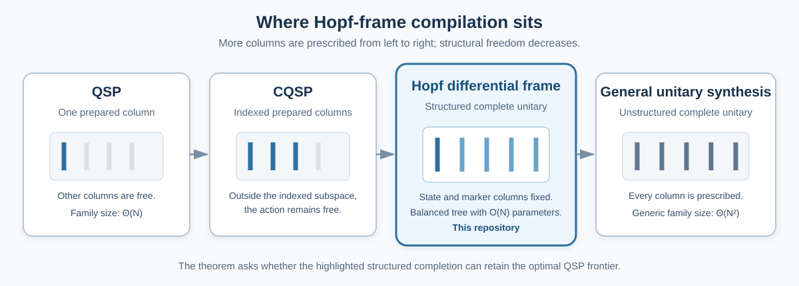

# Minimal Hopf interface: a structured QSP completion

[← Landing page](../README.md) · [Complete technical note](../REVIEW.md) · [Next: compiler theorem →](COMPILER_THEOREM.md)

This page states only the Hopf facts used by the compiler theorem. The full
coordinate inverse, optimization architecture, and gradient protocols remain in
the two Hopf papers and repositories.

For the synthesis result, the Hopf chart may be treated as a compact generator
of one structured unitary completion.

## 1. Translation from state-preparation language

Fix `n` system qubits and let

```math
N=2^n.
```

Ordinary state preparation specifies

```math
U_{\mathrm{prep}}|0^n\rangle=|\psi\rangle
```

and leaves all other columns of `U_prep` free.

The Hopf construction selects one particular completion:

```math
W_{\mathbb R}|0^n\rangle
=|\psi_{\mathbb R}\rangle,
```

```math
W_{\mathbb R}|\lambda(j)\rangle
=|e_j^{\mathbb R}\rangle,
\qquad 1\leq j<N.
```

The nonzero computational labels `lambda(j)` are fixed frame markers. The
vectors `|e_j>` are orthonormal directions associated with the magnitude
coordinates.

The compiler problem is therefore:

> implement the complete structured unitary `W_R`, not only a convenient
> preparation completion sharing its first column.

<p align="center">
  
</p>

## 2. Balanced binary tree and marker labels

The real Hopf chart assigns one angle to every internal node of a complete
binary tree with `N` leaves. The root splits amplitude between the left and
right halves of the computational basis. Descendant angles recursively split
the amplitude entering their subtrees.

Internal nodes are indexed breadth first. A node at depth `d` and position `r`
has index

```math
j=2^d+r,
\qquad
0\leq r<2^d.
```

Its computational marker is

```math
\boxed{
\lambda(j)=(2r+1)2^{n-d-1}.
}
```

Equivalently, the marker bit string is

```text
node prefix | 1 at the node target | all-zero lower suffix.
```

The left-subtree anchor is

```math
\ell_0(j)=r2^{n-d},
```

and the local split at node `j` mixes exactly

```math
|\ell_0(j)\rangle
\quad\text{and}\quad
|\lambda(j)\rangle
```

inside the node's subtree.

### Notation used throughout the repository

| Symbol | Meaning |
|---|---|
| `n` | number of system qubits |
| `N=2^n` | Hilbert-space dimension |
| `m` | clean ancillary qubits supplied to the compiler |
| `j` | breadth-first internal-node index |
| `d` | tree depth |
| `r` or `p` | node position or binary prefix at one depth |
| `theta_(d,p)` | magnitude angle at that tree node |
| `lambda(j)` | computational marker for node `j` |
| `|e_j>` | unit frame direction associated with node `j` |
| `W_R` | real Hopf differential frame |
| `D_ph` | diagonal leaf-phase layer |
| `W_(C,mag)=D_ph W_R` | phase-dressed complex magnitude frame |

Basis labels are ordered from the most significant tree decision to the least
significant one. The code uses the corresponding ordinary nonnegative integers.

## 3. Differential weights and coordinate domains

### 3.1 Oriented incoming amplitude

For internal node `j`, let `a_j(theta)` be the product of the sine or cosine
factors selected along the path from the root to that node. Differentiating the
local split replaces the node's subtree state by a unit orthogonal complement
`|e_j>` and gives

```math
\boxed{
\partial_{\theta_j}|\psi(\boldsymbol\theta)\rangle
=a_j(\boldsymbol\theta)|e_j(\boldsymbol\theta)\rangle,
\qquad
g_{j,j}=a_j(\boldsymbol\theta)^2.
}
```

For unrestricted real angles, `a_j` is oriented and can be negative. The
principal metric square root is

```math
\sqrt{g_{j,j}}=|a_j|.
```

### 3.2 Canonical domains

The standard Hopf chart uses the following domains.

For the real chart:

- depths `0,...,n-2` use
  ```math
  [0,\pi/2];
  ```
- the final magnitude depth uses
  ```math
  [0,2\pi),
  ```
  allowing the last sibling split to encode signs without a phase layer.

For the complex chart, every magnitude angle uses

```math
[0,\pi/2],
```

and one phase is attached to each leaf.

Only ancestor angles enter `a_j`. The final real depth is therefore not an
ancestor of any internal coordinate weight. On the canonical real and complex
magnitude domains,

```math
a_j\geq0,
\qquad
a_j=\sqrt{g_{j,j}}.
```

### 3.3 Singular coordinates

If

```math
g_{j,j}>0,
```

then `|e_j>` is the normalized coordinate derivative direction, with oriented
weight `a_j`.

If

```math
g_{j,j}=0,
```

then

```math
\partial_{\theta_j}|\psi\rangle=0.
```

The unit vector occupying marker column `lambda(j)` remains a chart-selected
orthogonal continuation determined by the complete parameter tuple. It is not
the normalization of a nonzero derivative. This distinction matters for
geometric interpretation but does not change the unitary compiler target.

The implementation exposes:

```text
incoming_amplitude
metric
sqrt_metric
regular_mask
regular_coordinate_mask(atol=...)
```

so unrestricted algebraic identities and tolerance-aware numerical boundary
classification are not conflated.

## 4. Complete addressed layers

At depth `d`, split a basis label as

```math
|p\rangle_P|x\rangle_T|z\rangle_Z,
```

where:

- `p` is the `d`-bit upper prefix;
- `x` is the next qubit and the rotation target;
- `z` is the lower suffix of length
  ```math
  s=n-d-1.
  ```

The complete depth operator is

```math
\boxed{
L_d^{(n)}
=I+
\sum_{p=0}^{2^d-1}
|p\rangle\!\langle p|
\otimes
\bigl(R_y(\theta_{d,p})-I\bigr)
\otimes
|0^s\rangle\!\langle0^s|.
}
```

The rotation convention is

```math
R_y(\alpha)=e^{-i\alpha Y}
=
\begin{pmatrix}
\cos\alpha&-\sin\alpha\\
\sin\alpha&\cos\alpha
\end{pmatrix}.
```

Thus:

1. the prefix selects one of `2^d` angles;
2. the target rotates only when every lower suffix bit is zero;
3. every nonzero-suffix sector is fixed.

The complete real frame is

```math
\boxed{
W_{\mathbb R}^{(n)}
=L_{n-1}^{(n)}\cdots L_1^{(n)}L_0^{(n)},
}
```

with `L_0` acting first on state vectors.

The zero-suffix condition is the decisive compiler structure. It allows the
state and complement columns created at earlier depths to remain fixed while a
whole depth of prefix-selected rotations is applied.

> **Technical checkpoint.** Verify the basis ordering, marker formula, layer
> order, and identity action on every nonzero-suffix sector. A formula valid
> only on the preparation input is not sufficient.

### Executable counterpart

- [Marker and anchor conventions](../compiler_robust_hopf/conventions.py)
- [Recursive state, oriented differentials, and frame](../compiler_robust_hopf/frames.py)
- [Independent addressed-layer construction](../compiler_robust_hopf/frames.py)
- [Frame and chart-domain tests](../tests/test_frames.py)

## 5. Two qubits: the whole interface in one matrix

For two qubits, the real chart has three angles:

```math
|\psi\rangle
=
\cos\theta_1
\bigl(\cos\theta_2|00\rangle+
      \sin\theta_2|01\rangle\bigr)
+
\sin\theta_1
\bigl(\cos\theta_3|10\rangle+
      \sin\theta_3|11\rangle\bigr).
```

The unit frame directions are

```math
|e_1\rangle
=-\sin\theta_1
 \bigl(\cos\theta_2|00\rangle+
       \sin\theta_2|01\rangle\bigr)
+\cos\theta_1
 \bigl(\cos\theta_3|10\rangle+
       \sin\theta_3|11\rangle\bigr),
```

```math
|e_2\rangle
=-\sin\theta_2|00\rangle+
 \cos\theta_2|01\rangle,
```

```math
|e_3\rangle
=-\sin\theta_3|10\rangle+
 \cos\theta_3|11\rangle.
```

The differential weights are

```math
\partial_{\theta_1}|\psi\rangle=|e_1\rangle,
```

```math
\partial_{\theta_2}|\psi\rangle
=\cos\theta_1|e_2\rangle,
\qquad
\partial_{\theta_3}|\psi\rangle
=\sin\theta_1|e_3\rangle.
```

The markers are

```math
\lambda(1)=10_2,
\qquad
\lambda(2)=01_2,
\qquad
\lambda(3)=11_2.
```

At

```math
\theta_1=\theta_2=\theta_3=\frac{\pi}{4},
```

computational column order gives

```math
W_{\mathbb R}
=
\begin{pmatrix}
\frac12&-\frac1{\sqrt2}&-\frac12&0\\[3pt]
\frac12& \frac1{\sqrt2}&-\frac12&0\\[3pt]
\frac12&0&\frac12&-\frac1{\sqrt2}\\[3pt]
\frac12&0&\frac12& \frac1{\sqrt2}
\end{pmatrix}
=
\begin{pmatrix}
|&|&|&|\\
\psi&e_2&e_1&e_3\\
|&|&|&|
\end{pmatrix}.
```

This one matrix shows the distinction from ordinary QSP: the first column loads
the state, while the remaining marker columns encode the coordinate frame used
by the inverse circuit.

## 6. The state-column obstruction

Let `Q` swap `|01>` and `|10>` while fixing `|00>` and `|11>`, and define

```math
V=W_{\mathbb R}Q.
```

Because `Q|00>=|00>`,

```math
V|00\rangle=W_{\mathbb R}|00\rangle=|\psi\rangle.
```

The two unitaries are exact preparation completions of the same state, but `V`
exchanges the marker columns for `e_1` and `e_2`.

For

```math
O=-Z\otimes I,
```

at the symmetric point,

```math
W_{\mathbb R}^{\dagger}O|\psi\rangle=|10\rangle,
```

whereas

```math
V^{\dagger}O|\psi\rangle=|01\rangle.
```

The same marker decoder therefore changes the coordinate gradient from

```math
(2,0,0)
```

to

```math
(0,\sqrt2,0).
```

<p align="center">
  
</p>

```math
\boxed{
\text{State-column equality does not imply valid inverse-frame decoding.}
}
```

### Executable counterpart

- [Counterexample construction](../compiler_robust_hopf/compiler_boundaries.py)
- [Distribution and decoded-gradient tests](../tests/test_compiler_boundaries.py)

## 7. Phase-dressed complex magnitude frame

For the complex chart, attach one phase `phi_l` to each leaf:

```math
D_{\mathrm{ph}}
=\sum_{\ell=0}^{N-1}
e^{i\phi_\ell}|\ell\rangle\!\langle\ell|.
```

The unitary used by the inverse-frame magnitude protocol is

```math
\boxed{
W_{\mathbb C,\mathrm{mag}}
=D_{\mathrm{ph}}W_{\mathbb R}.
}
```

It satisfies

```math
W_{\mathbb C,\mathrm{mag}}|0^n\rangle
=|\psi_{\mathbb C}\rangle,
```

```math
W_{\mathbb C,\mathrm{mag}}|\lambda(j)\rangle
=|e_j^{\mathbb C}\rangle.
```

Writing a basis label as `x=zb`, with the final bit as target,

```math
D_{\mathrm{ph}}
=
\sum_z|z\rangle\!\langle z|
\otimes
\begin{pmatrix}
e^{i\phi_{z0}}&0\\
0&e^{i\phi_{z1}}
\end{pmatrix}.
```

The phase dressing is therefore one exact total-width-`n` UCG. The complex
magnitude compiler is a direct corollary of the real-frame compiler.

The leaf-phase derivatives form a separate direct signed one-hot record. This
separation is algorithmic as well as dimensional: all `N` phase derivatives
cannot be additional columns of one `N`-dimensional frame.

## 8. What is inherited and what is local

The first Hopf paper supplies the balanced chart, inverse map, canonical domains,
diagonal metric, and coordinate directions. `Hopf-QBP` supplies the addressed
frame, inverse-frame magnitude record, direct phase record, checkpoint
interface, and statistical task boundaries.

This repository takes the complete real frame and phase-dressed complex
magnitude frame as synthesis targets. It proves:

- the complete frame-safe compiler contract;
- the exact failure of the weaker state-column contract;
- optimal all-workspace frame constructions;
- preservation of the global QBP record under frame-safe substitution.

For exact theorem, source-version, implementation, and test locations, see the
[fact-level source map](SOURCE_MAP.md).

---

[← Landing page](../README.md) · [Complete technical note](../REVIEW.md) · [Next: compiler theorem →](COMPILER_THEOREM.md)
