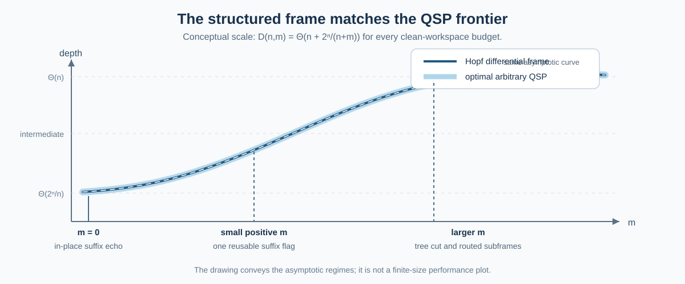

# One compiler across all workspace budgets

[← Theorem map](THEOREM_OVERVIEW.md) · [Complete compiler proof](COMPILER_THEOREM.md) · [Verification →](VERIFICATION.md)

The real Hopf-frame compiler is one architecture with three internal schedules.
All schedules implement the same addressed complete-operator layers and obey
the same clean-workspace contract.

The state-preparation framework of Yuan and Zhang supplies the common elementary
primitives and target frontier. The Hopf-specific part is how the complete frame
is exposed to those primitives without releasing its marker columns.

## 1. Public resource interface

For `N=2^n`, the unified resource selector takes:

```text
n        number of system qubits
m        available clean ancillary qubits, m >= 0
```

and returns:

```text
mode                         selected internal schedule
prefix_qubits                routed cut t, when applicable
subtree_qubits               s = n-t, when applicable
workspace_used_upper_bound   certified peak clean workspace
size_proxy                   explicit uniform upper-bound expression
depth_proxy                  explicit uniform upper-bound expression
```

The active implementation is in
[`unified_compiler.py`](../compiler_robust_hopf/unified_compiler.py). The values
are proof-oriented upper bounds rather than optimized hardware estimates.

## 2. Common target

At depth `d`, the compiler must implement

```math
L_d^{(n)}
=I+
\sum_{p=0}^{2^d-1}
|p\rangle\!\langle p|
\otimes
\bigl(R_y(\theta_{d,p})-I\bigr)
\otimes
|0^{n-d-1}\rangle\!\langle0^{n-d-1}|.
```

The complete frame is the ordered product of these layers. Every schedule must
act correctly on arbitrary logical inputs and return its workspace exactly to
zero.

## 3. Common external primitives

The compiler uses one uniform external framework:

| Primitive or theorem | Use |
|---|---|
| optimal all-workspace QSP frontier | target benchmark and matching comparison |
| exact ancilla-free multi-controlled `X` | suffix-predicate toggles and flags |
| all-workspace UCG synthesis | all prefix-selected rotations and the phase diagonal |
| coherent CNOT copy–uncopy | prefix fanout and parallel controls |

The earlier state-preparation paper is the historical predecessor. The active
compiler does not choose between the two papers according to `m`; the later
uniform theorem supplies the same framework in every regime.

## 4. Schedule Z: no clean workspace

When

```math
m=0,
```

one original suffix data bit is used as an in-place predicate carrier. The
half-angle echo implements each nonfinal addressed layer with:

- two total-width-`d+2` UCGs;
- four ancilla-free predicate toggles;
- two CNOT target echoes.

The logical bit is restored on all four predicate/value sectors. Summing the
layers gives

```math
S_Z(n)=O(N),
```

```math
D_Z(n)=O\left(n+\frac{N}{n}\right).
```

The exact construction is in
[`strict_zero_echo.py`](../compiler_robust_hopf/strict_zero_echo.py).

## 5. Schedule P1: direct clean flag

When at least one clean bit is available, each nonfinal depth may compute the
complete zero-suffix predicate into one reusable flag, apply one prefix-and-flag
UCG, and uncompute the flag.

The resource bound is

```math
S_{P1}(n,m)=O(N),
```

```math
D_{P1}(n,m)
=O\left(n^2+\frac{N}{n+m}\right).
```

For

```math
1\leq m<4n,
```

`n^2` is absorbed by `N/(n+m)`. The schedule therefore has the optimal order
throughout the small-positive-workspace regime.

## 6. Schedule P2: routed parallel subframes

For larger workspace, cut the tree after `t` depths:

```math
B=2^t,
\qquad
s=n-t.
```

The frame factorization is

```math
W_{\mathbb R}^{(n)}
=R_t^{(n)}F_t^{(n)},
```

with

```math
F_t^{(n)}
=W_{\mathbb R}^{(t)}\otimes|0^s\rangle\!\langle0^s|
+I\otimes\left(I-|0^s\rangle\!\langle0^s|\right),
```

```math
R_t^{(n)}
=\bigoplus_{r=0}^{B-1}W_s^{(r)}.
```

The conditioned prefix uses an explicit binary–one-hot decoder. The tail uses an
explicit CNOT/Fredkin router that moves the original suffix and one activation
token into the prefix-selected branch. The disjoint subtree frames run in
parallel, then every flag, copy, token, and data register is restored.

The convenient clean-workspace envelope is

```math
2B(s+1).
```

The compiler chooses the largest feasible cut satisfying

```math
2\,2^t(n-t+1)\leq m.
```

Maximality implies

```math
\frac{2^s}{s}
=O\left(\frac{N}{n+m}\right),
```

including the separately treated `s=1` endpoint. Hence

```math
S_{P2}(n,m)=O(N),
```

```math
D_{P2}(n,m)
=O\left(n+\frac{N}{n+m}\right).
```

The explicit decoder and router are in
[`tree_decoder.py`](../compiler_robust_hopf/tree_decoder.py) and
[`router.py`](../compiler_robust_hopf/router.py).

## 7. Dispatch rule

The proof-oriented implementation uses:

```text
m = 0             Schedule Z
1 <= m < 4n       Schedule P1
m >= 4n           largest feasible Schedule P2 cut
```

The threshold `4n` is not a tuned finite-size decision. It produces a clean
uniform proof. The internal resource selector may choose the exact feasible
cut and report the unused portion of the requested workspace.

<p align="center">
  
</p>

## 8. Complex magnitude frame

The arbitrary leaf-phase diagonal is one total-width-`n` UCG:

```math
D_{\mathrm{ph}}
=
\sum_z|z\rangle\!\langle z|
\otimes
\begin{pmatrix}
e^{i\phi_{z0}}&0\\
0&e^{i\phi_{z1}}
\end{pmatrix}.
```

The real frame and phase UCG restore the same workspace pool sequentially. The
complex magnitude resource selector therefore adds their size and depth but
uses the larger, not the sum, of their clean-workspace peaks.

## 9. Exact versus representative code

The repository implements the construction at several levels:

| Component | Representation |
|---|---|
| frames and strict-zero layers | complete dense logical operators |
| binary–one-hot decoder | explicit reversible X/CNOT/Toffoli schedule |
| branch router | explicit CNOT/Fredkin schedule and sparse complex-state simulator |
| subtree and phase UCGs | exact logical block action with resources imported from the UCG theorem |
| all-workspace frontier | integer and exact-rational ledgers |

The code does not duplicate the published elementary UCG and multi-controlled-
`X` synthesis. Their size and depth theorems are imported under the exact
circuit model stated in [the compiler proof](COMPILER_THEOREM.md).

## 10. Reproduction

```bash
python scripts/technical_walkthrough.py
python validate.py
python scripts/unified_resource_ledger.py --n 12
python scripts/strict_zero_echo_ledger.py --n 12
```

The walkthrough follows the three-schedule architecture. The complete evidence
levels and test ranges are listed in [Verification and evidence](VERIFICATION.md).

---

[← Theorem map](THEOREM_OVERVIEW.md) · [Complete compiler proof](COMPILER_THEOREM.md) · [Verification →](VERIFICATION.md)
